# ProofLoan A.I.

## Verifiable Cross-Chain Credit Underwriting for the Real World

Blockchain Whitepaper: https://docs.google.com/document/d/1heJo1Bt5VC07fGQ4jd_t2f2MR8wRzQsVBjmx91Chjxw/edit?tab=t.0

> **BUIDL CTC 2026 Fall — BUIDL For The Real World**
> **Primary track:** AI
> **Product surface:** Cross-chain credit underwriting / DeFi / RWA infrastructure
> **Cross-chain protocol:** Attestcoin Protocol
> **Execution target:** Creditcoin testnet demo boundary
> **Source chains:** Ethereum Sepolia + Polygon Amoy

<p align="center">
  <strong>ProofLoan turns cross-chain transaction history into a bounded, auditable loan decision.</strong><br/>
  Cryptographic evidence in → typed features → advisory AI → deterministic RiskGuard → constrained execution.
</p>

<p align="center">
  <a href="https://github.com/lucylow/PROOFLOAN---BUIDL-CTC-2026-Fall---BUIDL-For-The-Real-World">Repository</a> •
  <a href="https://dorahacks.io/hackathon/buidl-ctc-2026-fall/detail">Hackathon</a> •
  <a href="https://docs.creditcoin.org/creditcoin-usc">Attestcoin Protocol Docs</a>
</p>

---
> **Verified evidence → typed features → advisory AI → deterministic policy → explainable offer → controlled cross-chain execution**

ProofLoan is an evidence-first lending application designed around a simple principle:

> **AI can advise, but verified evidence and deterministic policy decide what is allowed to cross the execution boundary.**

The system combines:

* **Attestcoin-style verified facts** for evidence
* Typed feature extraction
* AI-assisted underwriting analysis
* A deterministic **RiskGuard** policy engine
* Explainable loan offers
* Wallet and network validation
* Creditcoin-oriented execution
* Replay protection
* Transaction reconciliation
* Failure recovery
* Borrower, lender, and judge-oriented interfaces
* Synthetic demo scenarios for adversarial testing

The project is designed for a hackathon/demo environment while using production-oriented architectural patterns.

---

# Table of Contents

1. [Executive Summary](#1-executive-summary)
2. [The Problem](#2-the-problem)
3. [The ProofLoan Thesis](#3-the-proofloan-thesis)
4. [Core Product Flow](#4-core-product-flow)
5. [Design Principles](#5-design-principles)
6. [High-Level Architecture](#6-high-level-architecture)
7. [System Context](#7-system-context)
8. [Component Architecture](#8-component-architecture)
9. [Evidence Architecture](#9-evidence-architecture)
10. [Evidence Provenance](#10-evidence-provenance)
11. [Canonical Evidence Manifest](#11-canonical-evidence-manifest)
12. [Typed Feature Layer](#12-typed-feature-layer)
13. [Advisory Underwriting](#13-advisory-underwriting)
14. [Deterministic RiskGuard](#14-deterministic-riskguard)
15. [Policy Trace](#15-policy-trace)
16. [Decision Integrity](#16-decision-integrity)
17. [Offer Construction](#17-offer-construction)
18. [Borrower Experience](#18-borrower-experience)
19. [Lender Experience](#19-lender-experience)
20. [Judge Mode](#20-judge-mode)
21. [Execution Boundary](#21-execution-boundary)
22. [Cross-Chain Transaction Flow](#22-cross-chain-transaction-flow)
23. [Application State Machine](#23-application-state-machine)
24. [Error Architecture](#24-error-architecture)
25. [Recovery Architecture](#25-recovery-architecture)
26. [Replay Protection](#26-replay-protection)
27. [RPC Reliability](#27-rpc-reliability)
28. [Security Model](#28-security-model)
29. [Privacy Model](#29-privacy-model)
30. [Threat Model](#30-threat-model)
31. [Analytics](#31-analytics)
32. [Portfolio Intelligence](#32-portfolio-intelligence)
33. [Demo Data](#33-demo-data)
34. [Demo Scenarios](#34-demo-scenarios)
35. [UI/UX Architecture](#35-uiux-architecture)
36. [Accessibility](#36-accessibility)
37. [Responsive Design](#37-responsive-design)
38. [Repository Structure](#38-repository-structure)
39. [Core Data Contracts](#39-core-data-contracts)
40. [API Architecture](#40-api-architecture)
41. [Configuration](#41-configuration)
42. [Environment Variables](#42-environment-variables)
43. [Local Development](#43-local-development)
44. [Testing Strategy](#44-testing-strategy)
45. [Failure-Path Testing](#45-failure-path-testing)
46. [Observability](#46-observability)
47. [Performance](#47-performance)
48. [Deployment](#48-deployment)
49. [Operational Runbook](#49-operational-runbook)
50. [Demo Runbook](#50-demo-runbook)
51. [Judge Narrative](#51-judge-narrative)
52. [Production Hardening](#52-production-hardening)
53. [Known Limitations](#53-known-limitations)
54. [Roadmap](#54-roadmap)
55. [Contributing](#55-contributing)
56. [Pull Request Standards](#56-pull-request-standards)
57. [Appendix A — Decision Object](#57-appendix-a--decision-object)
58. [Appendix B — Error Taxonomy](#58-appendix-b--error-taxonomy)
59. [Appendix C — Policy Examples](#59-appendix-c--policy-examples)
60. [Appendix D — Sequence Diagrams](#60-appendix-d--sequence-diagrams)
61. [Appendix E — Architecture Summary](#61-appendix-e--architecture-summary)

---

# 1. Executive Summary

ProofLoan explores an alternative architecture for decentralized and cross-chain credit underwriting.

Traditional lending applications tend to compress a large amount of uncertainty into a single score.

ProofLoan deliberately avoids making the score the final authority.

Instead, the system separates underwriting into several independently inspectable layers:

```text
                VERIFIED EVIDENCE
                       │
                       ▼
              TYPED FEATURE EXTRACTION
                       │
                       ▼
               ADVISORY UNDERWRITING
                       │
                       ▼
             DETERMINISTIC RISKGUARD
                       │
              ┌────────┴────────┐
              │                 │
            BLOCK             PASS
              │                 │
              ▼                 ▼
        EXPLANATION          OFFER
                                │
                                ▼
                         USER CONFIRMATION
                                │
                                ▼
                           WALLET GATE
                                │
                                ▼
                       CREDITCOIN EXECUTION
```

This separation provides several advantages:

1. Evidence can be inspected independently.
2. AI output can be treated as advisory.
3. Policy decisions can be deterministic.
4. Offers can be reproduced.
5. Execution can be blocked independently of underwriting.
6. Failures can be recovered without pretending a failed transaction succeeded.
7. Judges and users can understand *why* a decision happened.

---

# 2. The Problem

Cross-chain lending introduces several difficult problems simultaneously.

## 2.1 Evidence fragmentation

Relevant borrower information can exist across:

* chains
* attestations
* repayment records
* collateral events
* transaction histories
* lending protocols
* wallet addresses

The underwriting engine therefore cannot simply trust a single database row.

---

## 2.2 Evidence freshness

A fact can be valid when it is generated but become stale later.

For example:

```text
Collateral = $50,000
```

might have been true yesterday.

If the borrower has already withdrawn part of the collateral, the underwriting decision may no longer be valid.

ProofLoan therefore treats evidence freshness as part of decision integrity.

---

## 2.3 AI uncertainty

An AI model can be useful for:

* summarization
* classification
* feature interpretation
* risk explanation
* anomaly identification
* recommendation generation

But AI output should not silently become a financial authorization.

ProofLoan therefore uses the AI layer as an **advisory layer**.

---

## 2.4 Execution risk

Even a correct underwriting decision can encounter:

* wrong network
* unavailable RPC
* wallet rejection
* stale state
* insufficient balance
* contract revert
* duplicated submission
* timeout
* dropped transaction
* confirmation mismatch

The execution layer therefore needs its own controls.

---

# 3. The ProofLoan Thesis

ProofLoan is built around six boundaries.

### Boundary 1 — Evidence

What facts do we actually know?

### Boundary 2 — Features

How are those facts converted into typed underwriting signals?

### Boundary 3 — Advice

What does the advisory underwriting model recommend?

### Boundary 4 — Policy

What does deterministic policy permit?

### Boundary 5 — Offer

What financial terms can be presented?

### Boundary 6 — Execution

What can actually be submitted on-chain?

The core principle is:

> **A recommendation is not an authorization, and an authorization is not an execution.**

---

# 4. Core Product Flow

```mermaid
flowchart LR
    A[Borrower] --> B[Application]
    B --> C[Evidence Collection]
    C --> D[Evidence Verification]
    D --> E[Canonical Evidence Manifest]
    E --> F[Typed Features]
    F --> G[Advisory Underwriting]
    G --> H[RiskGuard]
    H --> I{Policy Result}

    I -->|BLOCK| J[Explain Block]
    I -->|PASS| K[Offer Construction]

    K --> L[Borrower Review]
    L --> M[Wallet Validation]
    M --> N[Execution Gate]
    N --> O[Creditcoin]
    O --> P[Receipt Reconciliation]
    P --> Q[Audit Trail]
```

---

# 5. Design Principles

## 5.1 Evidence first

Every material underwriting conclusion should be traceable to evidence.

---

## 5.2 Deterministic policy

The final policy gate should be reproducible.

Given:

```text
same evidence
same features
same policy version
same inputs
```

the result should be:

```text
same policy decision
```

---

## 5.3 AI is advisory

AI can recommend.

AI cannot bypass:

* evidence requirements
* policy thresholds
* freshness requirements
* execution gates
* replay protection

---

## 5.4 Explainability is a product feature

A user should be able to answer:

> Why was I approved?

or:

> Why was I blocked?

without reading application logs.

---

## 5.5 Fail closed

When critical state is uncertain:

```text
UNKNOWN ≠ PASS
```

A timeout should not become an approval.

---

## 5.6 Recovery is explicit

A failed transaction should not be silently retried forever.

The system should expose:

```text
what failed
why it failed
whether it may be retried
what state exists now
what action is safe next
```

---

# 6. High-Level Architecture

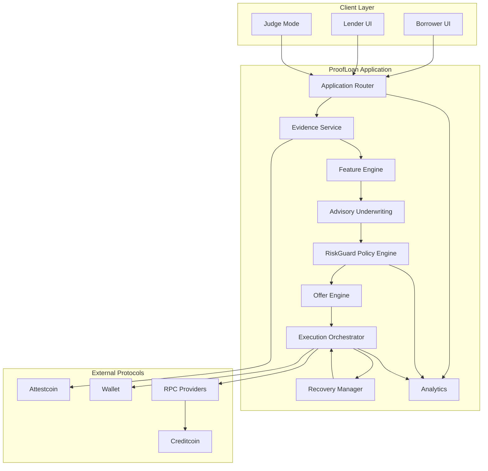

---

# 7. System Context

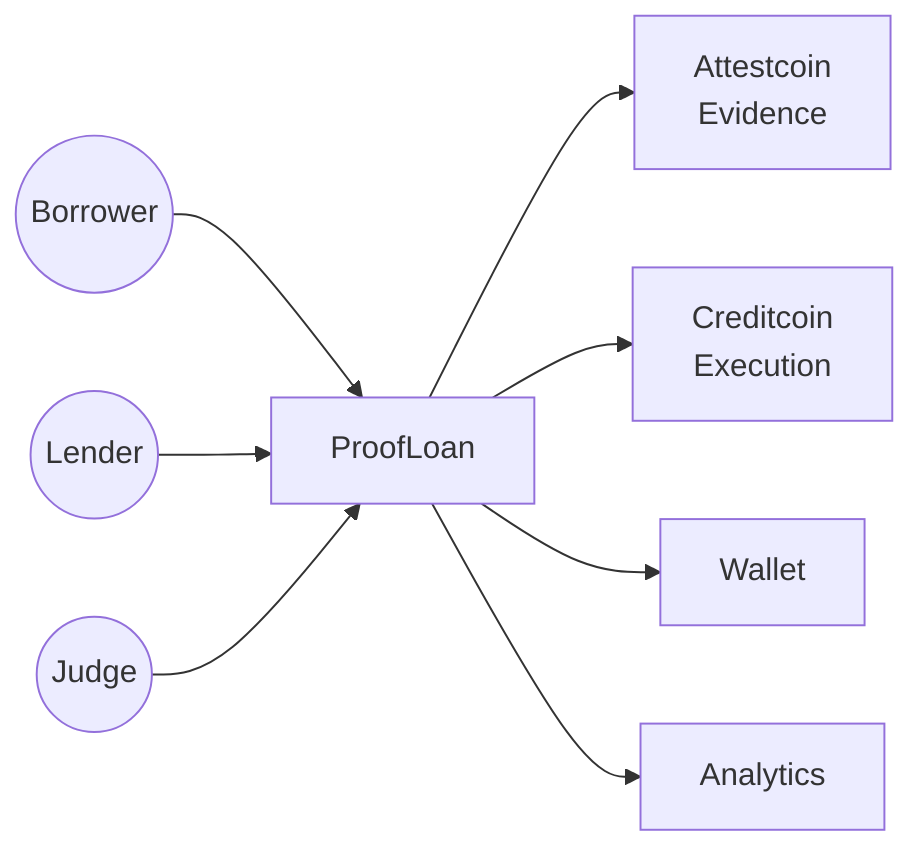

The system can therefore be understood as an orchestration layer between:

* users
* evidence
* underwriting
* policy
* execution

---

# 8. Component Architecture

```text
ProofLoan
│
├── UI
│   ├── Borrower
│   ├── Lender
│   ├── Judge
│   ├── Evidence Explorer
│   ├── Decision Explainer
│   ├── Offer Workbench
│   └── Recovery Center
│
├── Application
│   ├── Router
│   ├── Application Service
│   ├── Evidence Service
│   ├── Feature Engine
│   ├── Underwriting Service
│   ├── RiskGuard
│   ├── Offer Engine
│   └── Execution Orchestrator
│
├── Reliability
│   ├── Retry
│   ├── Timeout
│   ├── Circuit Breaker
│   ├── Idempotency
│   ├── Reconciliation
│   └── Recovery
│
├── Security
│   ├── Validation
│   ├── Wallet Gate
│   ├── Network Gate
│   ├── Policy Gate
│   └── Audit
│
└── Data
    ├── Applications
    ├── Evidence
    ├── Features
    ├── Decisions
    ├── Offers
    ├── Transactions
    └── Analytics
```

---

# 9. Evidence Architecture

Evidence is treated as a first-class domain object.

A simplified fact contains:

```ts
type VerifiedFact = {
  id: string;
  type: string;
  value: unknown;
  source: string;
  subject: string;
  issuedAt: string;
  observedAt: string;
  expiresAt?: string;
  verificationStatus: "verified" | "pending" | "invalid";
  proofRoot?: string;
  txHash?: string;
};
```

Example:

```json
{
  "id": "fact-repayment-001",
  "type": "REPAYMENT",
  "value": {
    "amount": 1200,
    "currency": "USDC",
    "status": "on_time"
  },
  "source": "attestcoin",
  "subject": "borrower-demo-001",
  "issuedAt": "2026-09-13T12:00:00Z",
  "observedAt": "2026-09-13T12:01:00Z",
  "verificationStatus": "verified"
}
```

---

# 10. Evidence Provenance

Every material fact should have a provenance chain.

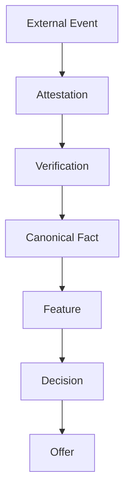

This allows a reviewer to move backwards:

```text
Offer
 ↓
Decision
 ↓
Feature
 ↓
Evidence
 ↓
Source
```

---

# 11. Canonical Evidence Manifest

The canonical manifest provides a stable representation of the evidence used for underwriting.

Example:

```ts
type EvidenceManifest = {
  applicationId: string;
  version: number;
  generatedAt: string;

  facts: Array<{
    id: string;
    type: string;
    fingerprint: string;
    freshness: "fresh" | "aging" | "stale";
    verification: "verified" | "invalid" | "unknown";
  }>;

  rootHash: string;
};
```

The root can be used to detect evidence drift.

```text
Evidence Set
     │
     ▼
Canonical Ordering
     │
     ▼
Serialization
     │
     ▼
Hash
     │
     ▼
Evidence Root
```

If the same evidence produces a different root unexpectedly, the system should stop before execution.

---

# 12. Typed Feature Layer

Raw evidence should not be sent directly into the policy engine.

Instead:

```text
Evidence
   ↓
Normalization
   ↓
Typed Features
   ↓
Policy
```

Example:

```ts
type UnderwritingFeatures = {
  repaymentReliability: number;
  collateralRatio: number;
  liquidityScore: number;
  delinquencyCount: number;
  evidenceFreshness: number;
  evidenceCompleteness: number;
  concentrationRisk: number;
};
```

Typed features make policy behavior easier to test.

---

# 13. Advisory Underwriting

The advisory layer can produce:

```ts
type AdvisoryAssessment = {
  score: number;
  riskBand: "low" | "moderate" | "high";
  confidence: number;

  factors: Array<{
    feature: string;
    impact: "positive" | "neutral" | "negative";
    explanation: string;
  }>;

  recommendation:
    | "approve"
    | "review"
    | "decline";
};
```

Important:

```text
AdvisoryAssessment ≠ FinalDecision
```

The advisory model can say:

```text
approve
```

while deterministic policy can still say:

```text
block
```

---

# 14. Deterministic RiskGuard

RiskGuard is the final underwriting policy layer.

Typical checks include:

```text
Evidence verified?
Evidence fresh?
Evidence complete?
Collateral sufficient?
LTV within limit?
Recent delinquency acceptable?
Pool liquidity sufficient?
Concentration acceptable?
Application state current?
Policy version valid?
```

Example:

```ts
type PolicyCheck = {
  id: string;
  label: string;
  passed: boolean;
  severity: "info" | "warning" | "critical";
  actual?: number | string;
  expected?: number | string;
  reason: string;
};
```

---

# 15. Policy Trace

Every policy decision should generate a trace.

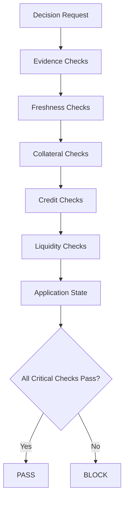

Example trace:

```text
✓ Evidence verified
✓ Evidence fresh
✓ Evidence complete
✓ LTV below maximum
✓ No recent severe delinquency
✓ Pool liquidity sufficient
✓ Application state current

RESULT: PASS
```

Blocked example:

```text
✓ Evidence verified
✗ Evidence freshness failed
✓ Collateral sufficient
✓ LTV acceptable

RESULT: BLOCK

Reason:
Required evidence is stale.
```

---

# 16. Decision Integrity

A decision should bind together:

```text
application ID
evidence root
feature fingerprint
policy version
policy trace
advisory assessment
timestamp
decision
```

Example:

```ts
type Decision = {
  id: string;
  applicationId: string;

  decision:
    | "approved"
    | "blocked"
    | "manual_review";

  evidenceRoot: string;
  featureFingerprint: string;
  policyVersion: string;

  policyChecks: PolicyCheck[];

  advisory?: AdvisoryAssessment;

  createdAt: string;
};
```

This makes decisions reproducible and auditable.

---

# 17. Offer Construction

An offer is created only after policy approval.

Example:

```ts
type LoanOffer = {
  id: string;
  applicationId: string;

  principal: number;
  apr: number;
  durationDays: number;

  collateralRequired: number;

  policyVersion: string;
  evidenceRoot: string;

  expiresAt: string;

  status:
    | "draft"
    | "presented"
    | "accepted"
    | "expired"
    | "executing"
    | "executed"
    | "cancelled";
};
```

The offer should be sealed against accidental mutation.

```text
Decision
   ↓
Offer Construction
   ↓
Offer Fingerprint
   ↓
User Confirmation
   ↓
Execution
```

---

# 18. Borrower Experience

The borrower journey is intentionally progressive.

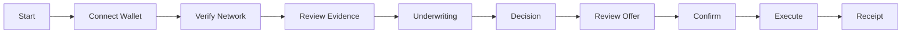

The UI should answer three questions at every stage:

### What happened?

Example:

> 8 verified facts were found.

### Why does it matter?

Example:

> Repayment history improved the advisory assessment.

### What happens next?

Example:

> RiskGuard is checking policy constraints.

---

# 19. Lender Experience

Lenders need a portfolio-level view rather than only individual applications.

Useful metrics include:

```text
Total supplied capital
Active positions
Outstanding principal
Average LTV
Average risk band
Concentration
Delinquency
Liquidity
Upcoming repayments
Policy blocks
```

Portfolio flow:

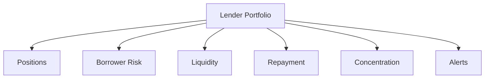

---

# 20. Judge Mode

Judge Mode is optimized for a short technical demonstration.

Instead of requiring a judge to understand every screen, it exposes:

```text
1. Application
2. Evidence
3. Features
4. Advisory score
5. Policy trace
6. Offer
7. Execution
8. Receipt
```

A judge should be able to follow:

```text
FACT
 ↓
FEATURE
 ↓
RECOMMENDATION
 ↓
POLICY
 ↓
OFFER
 ↓
TRANSACTION
```

---

# 21. Execution Boundary

The most important architectural boundary is between:

```text
Decision / Offer
```

and:

```text
Blockchain Execution
```

Execution must not happen merely because an AI model recommended approval.

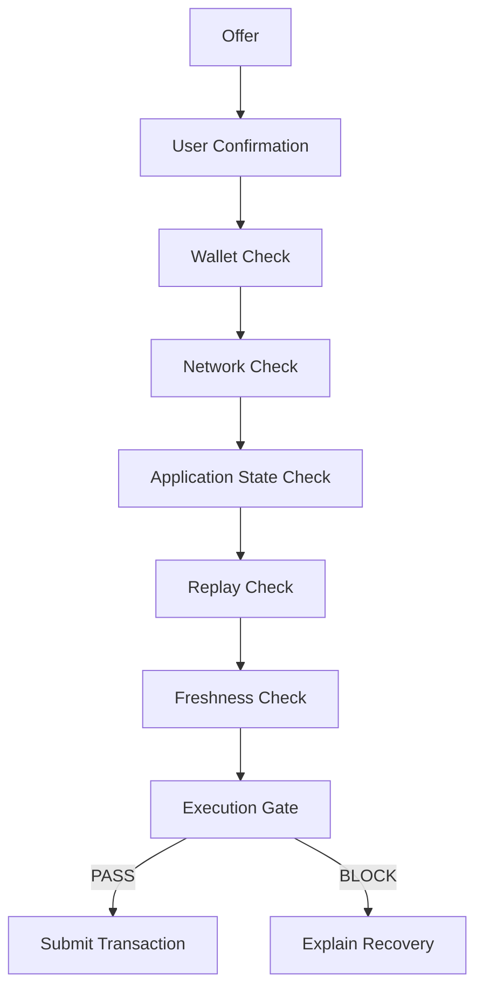

---

# 22. Cross-Chain Transaction Flow

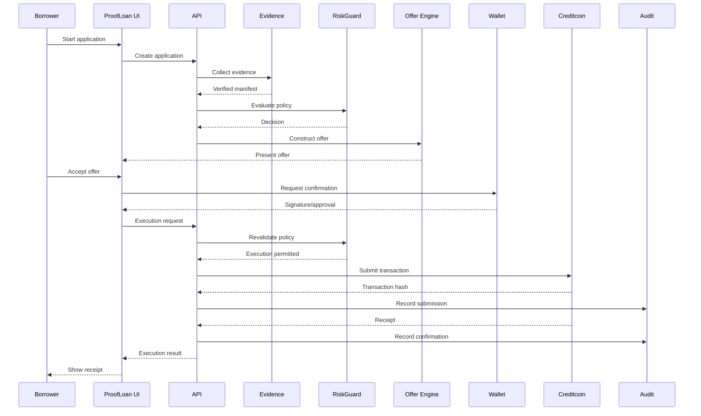

The important detail is that policy is revalidated before execution.

---

# 23. Application State Machine

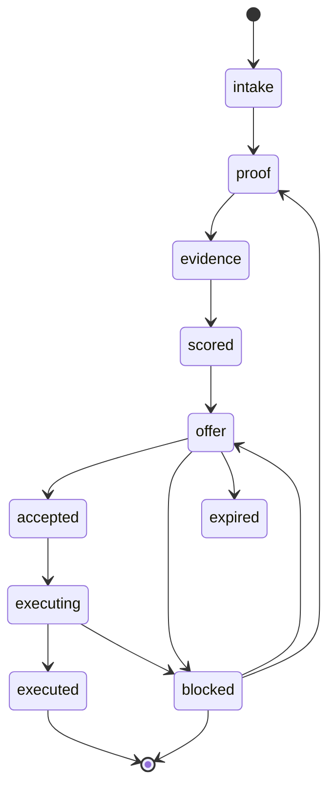

A state machine prevents impossible transitions.

For example:

```text
executed → intake
```

should never be accepted.

---

# 24. Error Architecture

Errors are classified rather than represented as generic strings.

Example taxonomy:

```text
VALIDATION
EVIDENCE
POLICY
WALLET
NETWORK
RPC
TRANSACTION
REPLAY
CONCURRENCY
SECURITY
CONFIGURATION
UNKNOWN
```

Example:

```ts
type ProofLoanError = {
  code: string;
  category:
    | "validation"
    | "evidence"
    | "policy"
    | "wallet"
    | "network"
    | "rpc"
    | "transaction"
    | "replay"
    | "security";

  message: string;
  retryable: boolean;
  userAction?: string;
  operationId?: string;
};
```

---

# 25. Recovery Architecture

A recovery action should be selected according to failure type.

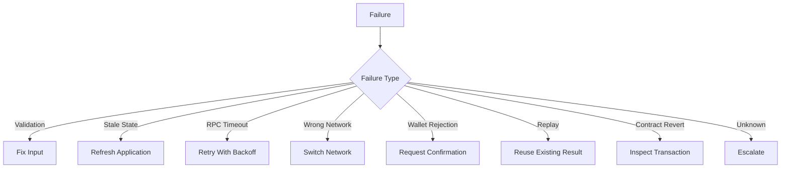

The UI should never display:

> Something went wrong.

when a more useful explanation exists.

Instead:

> Transaction submission timed out. The transaction may still exist on-chain. We will reconcile the receipt before allowing another submission.

---

# 26. Replay Protection

Execution requests should carry an idempotency key.

Example:

```text
replayKey =
  applicationId
  +
  offerId
  +
  wallet
  +
  operationType
```

A simplified flow:

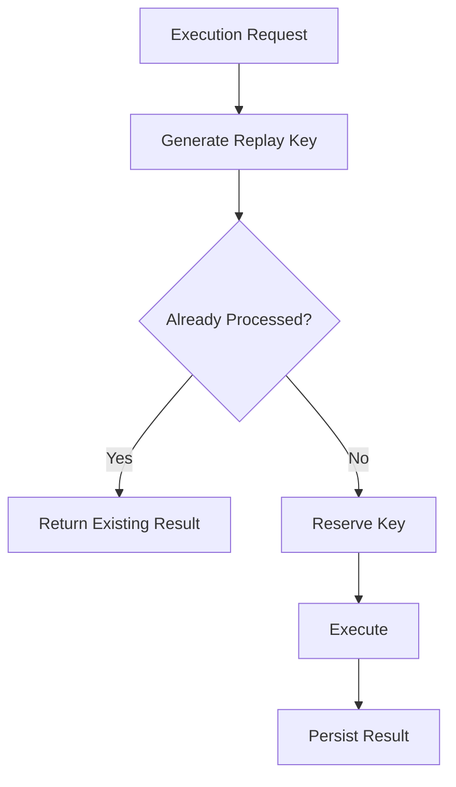

This prevents double acceptance and accidental duplicate execution.

---

# 27. RPC Reliability

Blockchain infrastructure is unreliable.

The system should assume:

```text
RPC timeout
RPC overload
provider outage
temporary disconnect
slow confirmation
stale block
```

A bounded retry policy can use:

```text
attempt 1 → immediate
attempt 2 → short delay
attempt 3 → longer delay
attempt 4 → stop
```

Never retry indefinitely.

---

## Circuit Breaker

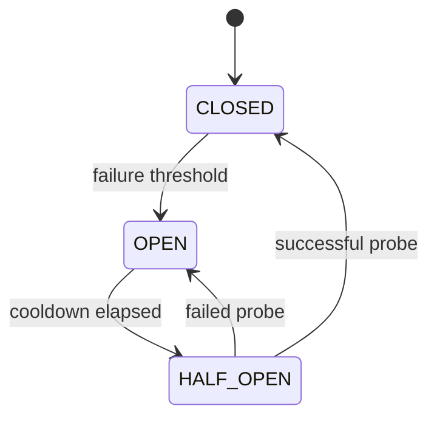

---

# 28. Security Model

ProofLoan uses layered security.

```text
                 SECURITY
                    │
       ┌────────────┼────────────┐
       │            │            │
   Input         Evidence      Execution
 Validation     Integrity       Gate
       │            │            │
       └────────────┼────────────┘
                    │
                Audit Trail
```

Security controls include:

* strict input validation
* wallet verification
* network validation
* evidence-root verification
* policy version binding
* offer integrity
* replay protection
* state validation
* secret redaction
* transaction reconciliation
* explicit user confirmation

---

# 29. Privacy Model

Not every piece of borrower information needs to be shown everywhere.

The UI should distinguish:

```text
public
user-visible
lender-visible
judge-visible
operator-only
```

A privacy-aware display might show:

```text
Repayment Reliability
92%
```

without exposing unnecessary transaction-level information.

---

# 30. Threat Model

Representative threats:

| Threat              | Mitigation                   |
| ------------------- | ---------------------------- |
| Tampered evidence   | Evidence root verification   |
| Stale evidence      | Freshness checks             |
| AI hallucination    | Deterministic policy         |
| Duplicate execution | Replay keys                  |
| Wrong network       | Network gate                 |
| Wallet mismatch     | Wallet validation            |
| RPC timeout         | Retry + reconciliation       |
| Contract revert     | Receipt classification       |
| State race          | Optimistic concurrency       |
| Offer mutation      | Offer fingerprint            |
| Secret leakage      | Log redaction                |
| UI spoofing         | Server-side execution checks |

---

# 31. Analytics

Analytics should model the full lifecycle.

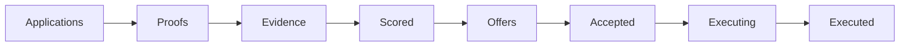

Useful funnel metrics:

```text
applications
proof completion
evidence completeness
policy approval rate
offer acceptance rate
execution success rate
execution failure rate
average underwriting time
average confirmation time
```

---

# 32. Portfolio Intelligence

Portfolio analytics should move beyond individual scores.

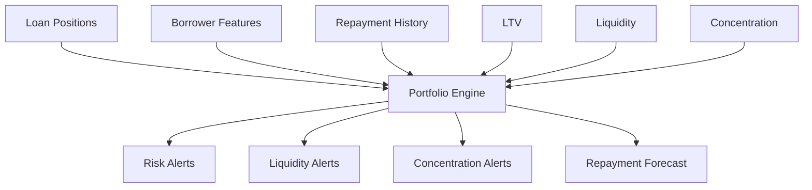

Example alerts:

```text
HIGH CONCENTRATION

28% of active capital is associated
with one borrower cluster.
```

or:

```text
LIQUIDITY WARNING

Available lending capacity is below
the configured operating threshold.
```

---

# 33. Demo Data

The repository can use synthetic data for demonstration.

Synthetic borrowers can represent different underwriting profiles:

```text
Prime
Near-prime
Emerging
Thin-file
Recovery
```

Synthetic evidence can include:

```text
REPAYMENT
COLLATERAL_DEPOSIT
LATE_PAYMENT
BORROW_ORIGINATED
COLLATERAL_RELEASED
LIQUIDATION_WARNING
```

Each fixture should clearly indicate:

```text
SYNTHETIC DEMO DATA
```

No demo fixture should be interpreted as a real borrower.

---

# 34. Demo Scenarios

A useful demo should include both successful and adversarial paths.

## Scenario 1 — Clean Approval

```text
Evidence: fresh
Collateral: sufficient
LTV: acceptable
Repayment: healthy
Liquidity: healthy

→ APPROVED
```

---

## Scenario 2 — Excessive LTV

```text
Collateral: insufficient

→ BLOCKED
Reason: maximum LTV exceeded
```

---

## Scenario 3 — Stale Evidence

```text
Evidence: verified
Freshness: stale

→ BLOCKED
Reason: underwriting evidence must be refreshed
```

---

## Scenario 4 — Tampered Evidence Root

```text
Expected root:
abc123

Observed root:
def456

→ SECURITY BLOCK
```

---

## Scenario 5 — Wrong Network

```text
Expected network:
Creditcoin

Wallet network:
Unsupported

→ EXECUTION BLOCK
```

---

## Scenario 6 — RPC Timeout

```text
Submission:
timeout

Transaction state:
unknown

→ RECONCILE
```

The system should not immediately create a second transaction.

---

## Scenario 7 — Duplicate Acceptance

```text
Offer already accepted

→ REPLAY DETECTED
→ Return existing operation state
```

---

# 35. UI/UX Architecture

The UI follows a mobile-first, progressive-disclosure approach.

Core primitives include:

```text
Badge
IconButton
Surface
SectionHeader
Metric
Progress
Tooltip
Modal
Skeleton
```

Higher-level components:

```text
ResponsiveShell
OnboardingFlow
EvidenceExplorer
DecisionExplainer
PolicyExplorer
OfferWorkbench
ApplicationTimeline
NotificationCenter
CommandSearch
ReceiptCard
```

---

# 36. Accessibility

Accessibility should not be an afterthought.

Important controls include:

* visible keyboard focus
* semantic buttons
* accessible labels
* readable contrast
* keyboard navigation
* screen-reader-friendly status messages
* reduced-motion support

Example CSS:

```css
@media (prefers-reduced-motion: reduce) {
  * {
    animation-duration: 1ms !important;
    animation-iteration-count: 1 !important;
    transition-duration: 1ms !important;
  }
}
```

---

# 37. Responsive Design

The primary layout should work across:

```text
mobile
tablet
desktop
wide desktop
```

A responsive application should not simply shrink the desktop dashboard.

Instead:

```text
Desktop:
sidebar + workspace + inspector

Tablet:
compact navigation + workspace

Mobile:
stacked cards + bottom navigation
```

---

# 38. Repository Structure

A recommended structure:

```text
proofloan-buidl/
│
├── app/
│   ├── routes/
│   ├── api/
│   └── layout/
│
├── components/
│   ├── ui/
│   ├── borrower/
│   ├── lender/
│   ├── judge/
│   ├── evidence/
│   ├── underwriting/
│   ├── offers/
│   └── recovery/
│
├── lib/
│   ├── evidence/
│   ├── features/
│   ├── underwriting/
│   ├── riskguard/
│   ├── execution/
│   ├── recovery/
│   ├── security/
│   ├── analytics/
│   └── validation/
│
├── data/
│   ├── borrowers/
│   ├── evidence/
│   ├── scenarios/
│   └── demo/
│
├── types/
│   ├── application.ts
│   ├── evidence.ts
│   ├── decision.ts
│   ├── offer.ts
│   └── transaction.ts
│
├── tests/
│   ├── unit/
│   ├── integration/
│   ├── policy/
│   ├── recovery/
│   └── e2e/
│
├── public/
│
├── README.md
├── package.json
└── tsconfig.json
```

---

# 39. Core Data Contracts

## Application

```ts
type Application = {
  id: string;
  borrowerId: string;

  stage:
    | "intake"
    | "proof"
    | "evidence"
    | "scored"
    | "offer"
    | "accepted"
    | "executing"
    | "executed"
    | "blocked";

  createdAt: string;
  updatedAt: string;

  version: number;
};
```

---

## Verified Fact

```ts
type VerifiedFact = {
  id: string;
  type: string;
  subject: string;
  source: string;

  value: unknown;

  issuedAt: string;
  observedAt: string;
  expiresAt?: string;

  verificationStatus:
    | "verified"
    | "pending"
    | "invalid";

  proofRoot?: string;
  txHash?: string;
};
```

---

## Decision

```ts
type Decision = {
  id: string;
  applicationId: string;

  decision:
    | "approved"
    | "blocked"
    | "manual_review";

  evidenceRoot: string;
  featureFingerprint: string;
  policyVersion: string;

  policyChecks: PolicyCheck[];

  createdAt: string;
};
```

---

## Transaction

```ts
type TransactionRecord = {
  operationId: string;

  applicationId: string;
  offerId: string;

  wallet: string;
  network: string;

  status:
    | "pending"
    | "submitted"
    | "confirmed"
    | "failed"
    | "unknown";

  txHash?: string;
  blockNumber?: number;

  submittedAt?: string;
  confirmedAt?: string;
};
```

---

# 40. API Architecture

A conceptual API surface:

```text
POST   /api/applications
GET    /api/applications/:id

POST   /api/applications/:id/evidence
GET    /api/applications/:id/evidence

POST   /api/applications/:id/underwrite
GET    /api/applications/:id/decision

POST   /api/applications/:id/offer
GET    /api/applications/:id/offer

POST   /api/applications/:id/accept
POST   /api/applications/:id/execute

GET    /api/applications/:id/transactions

GET    /api/portfolio
GET    /api/analytics
GET    /api/health
```

---

# 41. Configuration

Configuration should distinguish:

```text
application configuration
protocol configuration
risk policy
demo configuration
observability
```

Example:

```ts
const config = {
  policyVersion: "riskguard-v1",

  evidence: {
    maxAgeSeconds: 3600
  },

  execution: {
    timeoutMs: 30_000,
    maxRetries: 3
  },

  demo: {
    enabled: true
  }
};
```

---

# 42. Environment Variables

A typical environment might include:

```bash
NODE_ENV=development

NEXT_PUBLIC_APP_NAME=ProofLoan

ATTESTCOIN_RPC_URL=
CREDITCOIN_RPC_URL=

CREDITCOIN_CHAIN_ID=

EXECUTION_TIMEOUT_MS=30000
EXECUTION_MAX_RETRIES=3

RISK_POLICY_VERSION=riskguard-v1

DEMO_MODE=true

LOG_LEVEL=info
```

Never commit secrets.

Use:

```text
.env.local
```

and keep it outside version control.

---

# 43. Local Development

Install dependencies:

```bash
npm install
```

Run development server:

```bash
npm run dev
```

Run type checking:

```bash
npm run typecheck
```

Run tests:

```bash
npm test
```

Build:

```bash
npm run build
```

Start production server:

```bash
npm start
```

---

# 44. Testing Strategy

Testing should exist at several levels.

```text
                 TESTING
                    │
       ┌────────────┼────────────┐
       │            │            │
      Unit      Integration      E2E
       │            │            │
    Policy       API Flow      User Flow
    Math         Evidence      Execution
    Parsing      Recovery      Recovery
```

---

## Unit tests

Test:

* feature calculation
* LTV calculation
* policy rules
* evidence freshness
* fingerprints
* replay keys
* repayment math

---

## Integration tests

Test:

```text
evidence → features → decision
```

and:

```text
decision → offer → execution
```

---

## End-to-end tests

Test complete user journeys.

Example:

```text
connect wallet
→ verify network
→ inspect evidence
→ receive decision
→ review offer
→ confirm
→ execute
→ receipt
```

---

# 45. Failure-Path Testing

Failure tests are especially important for ProofLoan.

The test suite should deliberately simulate:

```text
empty evidence
invalid evidence
stale evidence
tampered evidence
AI malformed output
policy block
wallet rejection
wrong network
RPC timeout
RPC outage
transaction revert
duplicate request
stale application version
insufficient liquidity
expired offer
```

Example:

```ts
it("blocks stale evidence", async () => {
  const result = await evaluateApplication({
    evidenceFreshness: "stale"
  });

  expect(result.decision).toBe("blocked");
});
```

---

# 46. Observability

Every important operation should have an operation ID.

Example:

```text
operationId:
op_01J9P7...
```

Logs should make it possible to trace:

```text
request
 ↓
application
 ↓
evidence
 ↓
decision
 ↓
offer
 ↓
execution
 ↓
transaction
```

Metrics can include:

```text
underwriting_duration_ms
evidence_fetch_duration_ms
policy_evaluation_duration_ms
execution_duration_ms
rpc_failure_count
transaction_failure_count
replay_block_count
policy_block_count
```

---

# 47. Performance

The main performance risks are:

* external RPC calls
* evidence retrieval
* model inference
* transaction confirmation

Potential optimizations:

### Cache immutable evidence

Verified historical evidence can often be cached.

### Parallelize independent evidence requests

```text
source A ─┐
source B ─┼→ evidence manifest
source C ─┘
```

### Avoid unnecessary model calls

If deterministic policy already blocks an application due to missing required evidence, an expensive advisory call may not be necessary.

---

# 48. Deployment

A conceptual production architecture:

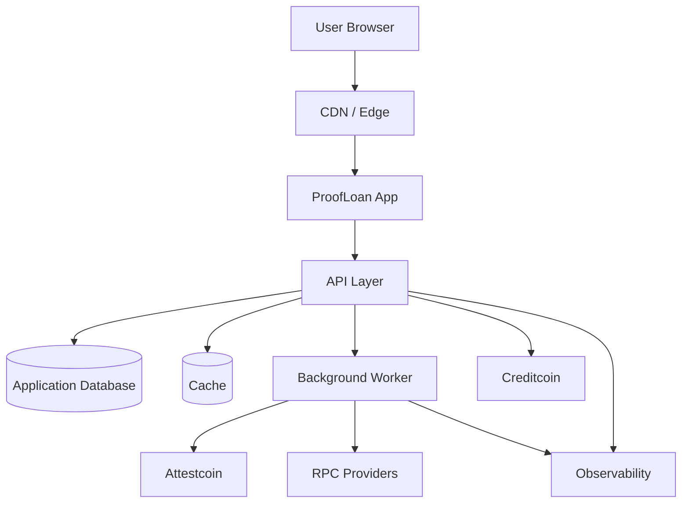

---

# 49. Operational Runbook

## If evidence retrieval fails

1. Mark evidence operation as degraded.
2. Do not fabricate missing facts.
3. Retry within configured bounds.
4. Surface the failure.
5. Require refresh if evidence remains unavailable.

---

## If RPC times out

1. Mark transaction state as unknown.
2. Do not immediately submit another transaction.
3. Attempt reconciliation.
4. Search by operation identity where possible.
5. Update transaction state.
6. Only permit retry when safe.

---

## If wallet is on the wrong network

1. Block execution.
2. Display expected network.
3. Display current network.
4. Offer network-switch action where supported.
5. Revalidate after switching.

---

## If evidence root changes

1. Mark decision stale.
2. Invalidate dependent offer.
3. Require re-underwriting.
4. Never execute against stale evidence.

---

# 50. Demo Runbook

A strong live demonstration can follow this sequence.

## Step 1 — Open Judge Mode

Show:

```text
ProofLoan
Evidence-backed cross-chain underwriting
```

---

## Step 2 — Select borrower

Choose a clean synthetic borrower.

---

## Step 3 — Show evidence

Highlight:

```text
verified
fresh
complete
```

---

## Step 4 — Show advisory score

Explain that the score is advisory.

---

## Step 5 — Open policy trace

Show deterministic checks.

---

## Step 6 — Show offer

Display:

```text
principal
APR
duration
collateral
expiration
```

---

## Step 7 — Execute

Demonstrate:

```text
wallet check
network check
replay check
policy revalidation
execution
```

---

## Step 8 — Show receipt

Finish with:

```text
transaction
confirmation
audit event
```

---

# 51. Judge Narrative

A concise technical narrative:

> ProofLoan does not ask an AI model to decide whether money should move.

Instead:

> Evidence is collected and verified first.

Then:

> Evidence becomes typed underwriting features.

Then:

> AI produces an advisory assessment.

Then:

> RiskGuard independently evaluates deterministic policy.

Then:

> Only an approved policy result can produce an executable offer.

Finally:

> The execution layer revalidates the state before submitting the transaction.

The architectural punchline:

```text
AI advises.
Evidence informs.
Policy decides.
Wallet authorizes.
Blockchain executes.
```

---

# 52. Production Hardening

Before production, strengthen:

## Identity

* authentication
* authorization
* wallet ownership proof

## Infrastructure

* redundant RPC providers
* persistent job queues
* database backups
* disaster recovery

## Security

* secret management
* dependency scanning
* penetration testing
* contract auditing

## Risk

* formal policy governance
* policy versioning
* model monitoring
* model drift detection

## Compliance

* jurisdiction-specific requirements
* lending restrictions
* privacy requirements
* sanctions and AML considerations where applicable

---

# 53. Known Limitations

ProofLoan's demo architecture intentionally simplifies several production concerns.

### Synthetic evidence

Demo fixtures are not production attestations.

### Simplified risk policy

A production lender would require substantially more comprehensive risk policy.

### Model risk

An advisory model can still be wrong.

### Blockchain finality

Transaction confirmation behavior varies across networks.

### Oracle risk

External evidence sources may be delayed or unavailable.

### Economic risk

A technical demo does not constitute a validated lending business model.

---

# 54. Roadmap

## Phase 1 — Demo

* Evidence explorer
* RiskGuard
* Advisory underwriting
* Offer flow
* Wallet integration
* Transaction demo
* Judge Mode

## Phase 2 — Protocol integration

* Real evidence adapters
* Real Creditcoin integration
* Persistent transaction reconciliation
* Production RPC routing

## Phase 3 — Portfolio intelligence

* lender dashboard
* repayment analytics
* concentration monitoring
* liquidity forecasting

## Phase 4 — Advanced underwriting

* richer feature extraction
* calibrated models
* model monitoring
* policy simulation

## Phase 5 — Production

* authentication
* governance
* security review
* operational controls
* compliance architecture

---

# 55. Contributing

Contributions should preserve the central architectural boundaries.

A change should clearly identify whether it affects:

```text
Evidence
Features
Advisory
Policy
Offer
Execution
Recovery
UI
Analytics
```

Avoid introducing hidden coupling between layers.

For example, UI code should not directly decide whether an on-chain transaction is permitted.

---

# 56. Pull Request Standards

Every significant PR should answer:

### What changed?

Describe the feature.

### Why?

Describe the product or architectural reason.

### What can fail?

Describe failure modes.

### How is failure recovered?

Describe recovery.

### How is it tested?

Include tests.

### Does it affect execution?

If yes, explain the security implications.

---

# 57. Appendix A — Decision Object

A complete conceptual decision:

```json
{
  "id": "decision-demo-001",
  "applicationId": "PL-DEMO-001",
  "decision": "approved",
  "evidenceRoot": "root_abc123",
  "featureFingerprint": "features_8b7d",
  "policyVersion": "riskguard-v1",
  "policyChecks": [
    {
      "id": "evidence_verified",
      "passed": true,
      "severity": "critical"
    },
    {
      "id": "evidence_fresh",
      "passed": true,
      "severity": "critical"
    },
    {
      "id": "ltv_limit",
      "passed": true,
      "severity": "critical"
    },
    {
      "id": "liquidity",
      "passed": true,
      "severity": "critical"
    }
  ]
}
```

---

# 58. Appendix B — Error Taxonomy

A recommended taxonomy:

```text
PL-VAL-001   Invalid request
PL-EVD-001   Evidence unavailable
PL-EVD-002   Evidence stale
PL-EVD-003   Evidence invalid
PL-EVD-004   Evidence root mismatch

PL-POL-001   Policy blocked
PL-POL-002   Policy configuration invalid

PL-WAL-001   Wallet unavailable
PL-WAL-002   Wallet rejected

PL-NET-001   Wrong network

PL-RPC-001   RPC timeout
PL-RPC-002   RPC unavailable

PL-TX-001    Transaction reverted
PL-TX-002    Transaction confirmation timeout

PL-RPL-001   Replay detected

PL-CON-001   Concurrent state change

PL-SEC-001   Security validation failed
```

The error code should be stable even if the human-readable message changes.

---

# 59. Appendix C — Policy Examples

## Maximum LTV

```ts
function checkLtv(
  collateral: number,
  principal: number,
  maxLtv: number
) {
  const ltv = principal / collateral;

  return {
    passed: ltv <= maxLtv,
    actual: ltv,
    expected: maxLtv
  };
}
```

---

## Evidence freshness

```ts
function checkFreshness(
  observedAt: Date,
  now: Date,
  maxAgeMs: number
) {
  return now.getTime() - observedAt.getTime() <= maxAgeMs;
}
```

---

## Required evidence

```ts
function hasRequiredEvidence(
  facts: VerifiedFact[]
) {
  const required = [
    "REPAYMENT",
    "COLLATERAL_DEPOSIT"
  ];

  return required.every(type =>
    facts.some(
      fact =>
        fact.type === type &&
        fact.verificationStatus === "verified"
    )
  );
}
```

---

# 60. Appendix D — Sequence Diagrams

## Underwriting sequence

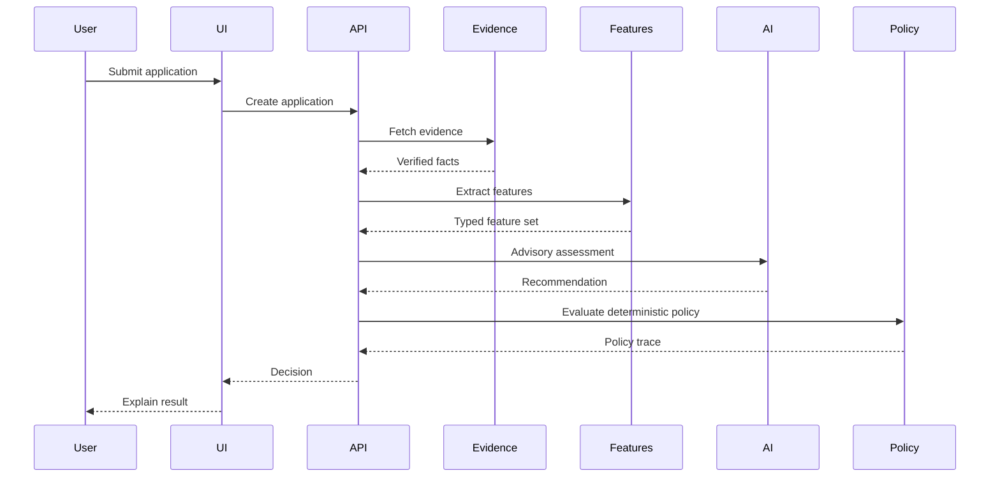

---

## Failure recovery sequence

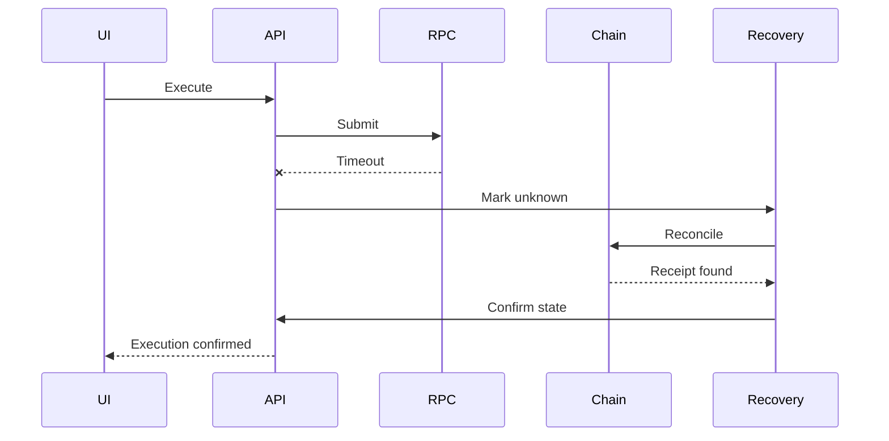

---

# 61. Appendix E — Architecture Summary

The entire system can be reduced to one diagram:

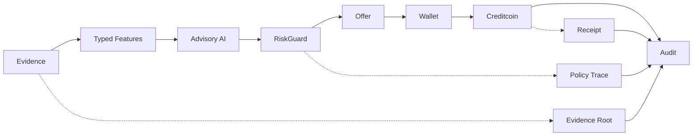

---

# Final Architecture

```text
┌──────────────────────────────────────────────────────────────┐
│                        PROOFLOAN                              │
│                                                              │
│  ┌───────────────┐                                           │
│  │ User Interface │                                           │
│  └───────┬───────┘                                           │
│          │                                                   │
│          ▼                                                   │
│  ┌─────────────────────┐                                    │
│  │ Application Service  │                                    │
│  └─────────┬───────────┘                                    │
│            │                                                 │
│            ▼                                                 │
│  ┌─────────────────────┐                                    │
│  │ Evidence Layer       │──────► Attestcoin                 │
│  └─────────┬───────────┘                                    │
│            │                                                 │
│            ▼                                                 │
│  ┌─────────────────────┐                                    │
│  │ Typed Features       │                                    │
│  └─────────┬───────────┘                                    │
│            │                                                 │
│            ▼                                                 │
│  ┌─────────────────────┐                                    │
│  │ Advisory Underwriting│                                    │
│  └─────────┬───────────┘                                    │
│            │                                                 │
│            ▼                                                 │
│  ┌─────────────────────┐                                    │
│  │ RiskGuard            │                                    │
│  │ Deterministic Policy │                                    │
│  └─────────┬───────────┘                                    │
│            │                                                 │
│            ▼                                                 │
│  ┌─────────────────────┐                                    │
│  │ Explainable Offer    │                                    │
│  └─────────┬───────────┘                                    │
│            │                                                 │
│            ▼                                                 │
│  ┌─────────────────────┐                                    │
│  │ Execution Gate       │                                    │
│  └─────────┬───────────┘                                    │
│            │                                                 │
│            ▼                                                 │
│  ┌─────────────────────┐                                    │
│  │ Wallet / Network     │                                    │
│  │ / Replay Validation  │                                    │
│  └─────────┬───────────┘                                    │
│            │                                                 │
│            ▼                                                 │
│  ┌─────────────────────┐                                    │
│  │ Creditcoin Execution │                                    │
│  └─────────┬───────────┘                                    │
│            │                                                 │
│            ▼                                                 │
│  ┌─────────────────────┐                                    │
│  │ Receipt Reconciliation│                                   │
│  └─────────┬───────────┘                                    │
│            │                                                 │
│            ▼                                                 │
│  ┌─────────────────────┐                                    │
│  │ Audit / Analytics    │                                    │
│  └─────────────────────┘                                    │
│                                                              │
└──────────────────────────────────────────────────────────────┘
```

---

# The Core Idea

ProofLoan is not fundamentally an AI lending application.

It is an **evidence-to-execution control system** for cross-chain credit.

The architecture deliberately separates:

```text
Evidence
   ↓
Interpretation
   ↓
Advice
   ↓
Policy
   ↓
Offer
   ↓
Authorization
   ↓
Execution
```

That separation is the core safety and explainability mechanism.

The resulting design gives the application six properties:

```text
✓ Evidence is inspectable
✓ Features are typed
✓ AI is advisory
✓ Policy is deterministic
✓ Offers are explainable
✓ Execution is controlled
```

And when something goes wrong:

```text
✓ Failure is visible
✓ State is preserved
✓ Transactions are reconciled
✓ Retries are bounded
✓ Replay is prevented
✓ Recovery is explicit
```

## ProofLoan in one sentence

> **ProofLoan turns verified cross-chain evidence into explainable credit decisions while keeping AI advisory, policy deterministic, and blockchain execution behind an explicit security boundary.**

---

## Disclaimer

This repository is a technical prototype/demo architecture. Synthetic borrower and transaction data should be treated as demonstration fixtures only. Nothing in this repository constitutes a lending offer, investment advice, credit decision for a real person, or production financial service.
