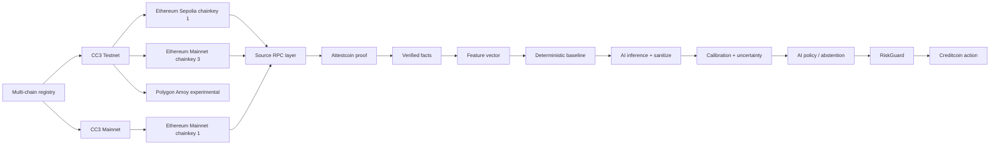

# ProofLoan

**ProofLoan** is a Creditcoin-branded cross-chain credit underwriting prototype for BUIDL CTC 2026 Fall. It turns an on-chain transaction history into a bounded, auditable loan decision through a deliberate trust boundary: evidence is verified by the Attestcoin Protocol, inference is advisory, RiskGuard is deterministic, and execution is constrained to a simulated Creditcoin testnet transaction boundary.

## Hackathon fit

ProofLoan targets the **AI / DeFi** intersection. The project meaningfully integrates the **Attestcoin Protocol** through an Attestcoin Protocol USC SDK adapter and the **Attestcoin proof worker** boundary. A proof request produces typed `VerifiedFact` records with source chain, source block, transaction hash, event type, amount, verification block, freshness, and proof root. Raw RPC responses are not admitted as financial truth.

The submission page requires working Attestcoin Protocol integration code, technical documentation, a GitHub repository with a README, a whitepaper or deck URL, and a prototype demo video. The official challenge brief also requires deployment to a testnet and evaluates the depth of Attestcoin Protocol utilization. See the [BUIDL CTC 2026 Fall brief](https://dorahacks.io/hackathon/buidl-ctc-2026-fall/detail) and the [Attestcoin Protocol USC SDK documentation](https://docs.creditcoin.org/creditcoin-usc/dapp-builder-infrastructure/usc-sdk).

## Demo flow

1. The borrower enters a wallet address and selects **Ethereum Sepolia**, **Ethereum Mainnet**, or experimental **Polygon Amoy**.
2. The server dispatches a proof request through the typed Attestcoin Protocol USC SDK adapter and Attestcoin proof worker boundary.
3. The proof worker result is decoded into immutable-looking `VerifiedFact` records and a compact evidence root.
4. A typed `FeatureVector` covers repayment count, late payments, leverage ratio, wallet age, evidence count, freshness, and fixed 7 / 30 / 180-day volume windows.
5. The server-side AI underwriting pipeline validates facts, engineers features, scores a deterministic baseline, optionally infers with an LLM, then sanitizes, calibrates, estimates uncertainty, explains with evidence links, and applies abstention policy. It returns calibrated 30-day and 90-day PD (`pd30 ≤ pd90`), confidence, a risk tier, and only the exact reason codes `STRONG_REPAYMENT_HISTORY`, `RECENT_LATE_PAYMENT`, `HIGH_LEVERAGE`, and `SPARSE_EVIDENCE`.
6. **RiskGuard** deterministically checks amount, LTV, rate, freshness, confidence, and pool liquidity before an offer is shown. The AI layer is advisory and cannot bypass Attestcoin evidence or RiskGuard.
7. The borrower accepts the offer, after which the typed execution boundary records a simulated **Creditcoin testnet** transaction and appends the event to the audit trail.

The state labels are frozen to: `Intake`, `EvidencePending`, `EvidenceVerified`, `Scored`, `OfferPrepared`, `AwaitingAcceptance`, `Executed`, and `Rejected`.

## Architecture



The database schema contains `loan_applications`, `verified_facts`, `decisions`, and `offers`, with audit fields for evidence root, model version, policy hash, and decision hash. The current hackathon demo keeps the active snapshot in memory for fast preview iteration while the schema is ready for durable persistence and contract-backed testnet wiring.

## Local development

```bash
pnpm install
pnpm dev
```

Attestcoin Protocol endpoints are environment-driven. Copy `.env.example` and override the Creditcoin RPC, Proof Builder, and source-chain RPC values for the target testnet:

```bash
ATTESTCOIN_ENVIRONMENT=cc3-testnet
CREDITCOIN_RPC_URL=
CREDITCOIN_TESTNET_RPC_URL=
CREDITCOIN_MAINNET_RPC_URL=
CREDITCOIN_PROOF_BUILDER_URL=
ETHEREUM_SEPOLIA_RPC_URL=
ETHEREUM_MAINNET_RPC_URL=
POLYGON_AMOY_RPC_URL=
ATTESTCOIN_TIMEOUT_MS=15000
ATTESTCOIN_RETRY_COUNT=2
ATTESTCOIN_CACHE_TTL_MS=120000
ATTESTCOIN_MAX_CONCURRENCY=2
PROOFLOAN_DEMO_MODE=true
PROOFLOAN_DEMO_FALLBACK=true
PROOFLOAN_DEMO_LABELS=true
PROOFLOAN_DEMO_PROFILE=strong-borrower
```

The AI underwriting pipeline, including model profiles, abstention, and diagnostics, is documented in `AI_FEATURE_UPGRADE_README.md`. The code-level walkthrough is in `AI_FEATURE_UPGRADE_100_PLUS_PAGES.md`.

The AI × blockchain feature layer sits on top of that pipeline without replacing it. Cross-chain observations become Attestcoin-verified evidence, then wallet / graph / temporal features, proof-and-source confidence, an advisory blockchain score, uncertainty/abstention, and AI underwriting context before RiskGuard and the Creditcoin action. Public procedures live under `ai.blockchain.features`, `ai.blockchain.score`, `ai.blockchain.fingerprint`, `ai.blockchain.route`, `ai.blockchain.walletRisk`, and `ai.blockchain.promptContext`. Blockchain data remains evidence and context; it cannot invent facts or rise above the Attestcoin verification boundary. See `AI_BLOCKCHAIN_FEATURE_UPGRADE_README.md` and `AI_BLOCKCHAIN_FEATURE_UPGRADE_120_PAGES.md`.

The durable Attestcoin readability worker (source-event discovery, attestation wait, proof coordination, ASC submission, retries, and catch-up) is documented in `OFFCHAIN_WORKER_README.md`. The page-sized code walkthrough is in `OFFCHAIN_WORKER_CODE_COMPENDIUM_100_PLUS_PAGES.md`. Live proofs still use the USC SDK Proof Builder and Block Prover precompile; the worker layer does not fabricate those implementations.

The Attestor Operator integration, including hot Attestor / cold Stash custody, AuthorizedOnly registration, Idle → Waiting → Active lifecycle planning, CC3 + Ethereum WebSocket RPC checks, and safe (non-submitting) operator action plans, is documented in `ATTESTOR_OPERATOR_INTEGRATION_README.md`. The code-level walkthrough is in `ATTESTOR_OPERATOR_INTEGRATION_100_PLUS_PAGES.md`.

Useful checks:

```bash
pnpm check
pnpm test
pnpm build
```

## Deploy to Creditcoin testnet and mainnet

ProofLoan contracts compile for Creditcoin Frontier with **evmVersion shanghai** and deploy with legacy type-0 transactions. Networks:

| Network | Chain ID | RPC | Explorer |
|---|---|---|---|
| CC3 Testnet | 102031 | `https://rpc.cc3-testnet.creditcoin.network` | https://creditcoin-testnet.blockscout.com/ |
| CC3 Mainnet | 102030 | `https://rpc.cc3-mainnet.creditcoin.network` | https://creditcoin.blockscout.com/ |

Dry-run by default (compile + live chain-ID preflight, no broadcast):

```bash
pnpm deploy:compile
pnpm deploy:preflight -- --network cc3-testnet
pnpm deploy:testnet
pnpm deploy:mainnet
```

To broadcast, fund an EVM account with tCTC or CTC:

```bash
export CREDITCOIN_DEPLOYER_PRIVATE_KEY=0x...
export CREDITCOIN_DEPLOY_GUARDIAN=0x...   # optional; defaults to the deployer
pnpm deploy:testnet -- --broadcast

CONFIRM_MAINNET=yes DEPLOY_BROADCAST=true pnpm deploy:mainnet -- --broadcast
```

Mainnet broadcasts require `CONFIRM_MAINNET=yes` and refuse to send while `PROOFLOAN_DEMO_MODE=true`. Successful deploys write `deployments/cc3-testnet.json` or `deployments/cc3-mainnet.json`. A leftover testnet `CREDITCOIN_RPC_URL` cannot silently target mainnet; set `ATTESTCOIN_ENVIRONMENT=cc3-mainnet` and `CREDITCOIN_MAINNET_RPC_URL` instead.

## Security posture

The AI model is never the financial oracle and never the signer. External text and raw source-chain payloads are treated as data. The policy layer owns the allowable action space, historical outputs retain their version and hash identifiers, and the execution path is only entered after offer acceptance and deterministic RiskGuard checks.

## Submission metadata

| Field | Value |
|---|---|
| Project | ProofLoan |
| Sector | AI / DeFi / RWA infrastructure |
| Network | Creditcoin testnet demo boundary |
| Cross-chain source | Ethereum Sepolia, Ethereum Mainnet, Polygon Amoy (experimental / preview-only) |
| Protocol | Attestcoin Protocol |
| SDK | Attestcoin Protocol USC SDK |
| Proof component | Attestcoin proof worker |
| Policy component | RiskGuard |
| Execution | Simulated Creditcoin testnet transaction submission |


## Current demo boundary

The borrower intake accepts either a wallet address or a mined source transaction hash. A wallet address intentionally selects the labeled preview adapter so judges can run the end-to-end interface without external chain history. A 32-byte source transaction hash selects the official `@gluwa/usc-sdk` path: `ProofBuilder` requests an Attestcoin Protocol proof and `PrecompileBlockProver` verifies it against the Creditcoin testnet boundary. Live transaction-hash applications require database persistence before an offer is prepared; preview applications may use the in-memory fallback only when the managed database endpoint is unavailable.

The repository validates the core state machine and replay protection through Vitest, and the landing, intake, and documentation surfaces have been visually checked. A final browser click-through from proof request to Executed UI state should be run in a connected preview session before submission.

## DApp navigation upgrade

The DApp navigation upgrade exposes Dashboard, Borrow, Applications, Credit File, Evidence, Readability, Proving, Attestor Settings, Governance, Demo Data, AI Mock Lab, Decisions, Offers, Activity, Documentation, Support, and Settings. The responsive shell includes a collapsible desktop sidebar, mobile drawer and bottom navigation, route-aware breadcrumbs, persisted sidebar preferences, command palette search, keyboard navigation, notification center, wallet connection UI for Sepolia, Ethereum Mainnet, and Polygon Amoy, document-title synchronization, contextual application sub-navigation, and route-level empty/error states.

The root route `/` is the DApp Dashboard. The existing verifiable credit application engine remains available at `/intake` and continues to use the existing ProofLoan backend and tRPC procedures as the source of financial truth.

## Attestcoin readability

Cross-chain readability is a first-class worker, not a UI label. `/readability` and the `readability.*` tRPC procedures scan focused source events, wait for attestation, construct Merkle and continuity proofs, verify them through the Block Prover precompile at `0x0FD2`, and require source receipt status `0x1` before ProofLoan business logic. Generic `Transfer` logs are rejected. Preview proofs are labeled educational; live delivery uses the existing `@gluwa/usc-sdk` Proof Builder path. See `ATTESTCOIN_READABILITY_UPGRADE_README.md`.

## Attestcoin transaction proving

Readability Step 2 is implemented as a dedicated four-phase proving subsystem: **Query → Proof Generation → Verification → Data Extraction**. `/transaction-proving` and the `transactionProving.*` tRPC procedures plan a chainKey + transaction-hash query, wrap Merkle inclusion and continuity proofs in a fingerprintable envelope, estimate continuity cost from the published CTC formula, and refuse to decode transaction bytes until verification succeeds. Local Merkle/continuity helpers are educational; production verification stays on the official Proof Builder and Block Prover adapter. See `ATTESTCOIN_TRANSACTION_PROVING_UPGRADE_README.md`.

## Per-chain Attestor settings

Official CC3 Mainnet and CC3 Testnet Attestor operator settings live in `shared/attestorSettings.ts`. Ethereum Mainnet uses **chainKey 1** on CC3 Mainnet and **chainKey 3** on CC3 Testnet, with pinned `3.128.0-mainnet` / `3.128.0-testnet` images. Boot-node addresses and operator authorization data are not invented. See `/attestor-settings` and `ATTESTCOIN_PER_CHAIN_ATTESTOR_SETTINGS_README.md`.

## Mock data and demo fallback

`/demo` and the `demo.*` tRPC procedures provide deterministic borrower/operator/provider scenarios, synthetic `VerifiedFact` records marked `evidenceMode=mock`, and an explicit live-provider fallback. **Live Attestcoin failures stay failed unless `PROOFLOAN_DEMO_MODE=true`.** When both demo mode and `PROOFLOAN_DEMO_FALLBACK=true` are set, a Proof Builder / RPC / attestor outage can continue into clearly labeled mock evidence, demo underwriting, and RiskGuard. The extended catalog adds 180 offline cases plus `demo.extendedCases`, `demo.extendedCase`, `demo.searchExtendedCases`, `demo.extendedBatch`, and `demo.evaluateExtendedCase`. Mock facts are never presented as cryptographically verified live Attestcoin facts. See `DEMO_MOCK_FALLBACK_README.md` and `server/demo/extended/EXTENDED_MOCK_DATA_UPGRADE_README.md`.

## AI mock underwriting lab

`/ai-mock` and the `aiMock.*` tRPC procedures expose 22 deterministic AI interpretation scenarios: feature vectors, contributions, confidence bands, reason codes, what-if recommendations, proof latency, and failure states. Mock facts stay labeled `evidenceMode=mock`. The AI mock layer does not replace Attestcoin verification, Creditcoin application processing, or RiskGuard. See `AI_MOCK_DATA_README.md`, `AI_MOCK_INTEGRATION.md`, and `AI_MOCK_DATA_120_PAGES.md`.

## DAO governance

`/governance` and the `dao.*` tRPC procedures expose a ProofLoan-specific DAO prototype: proposal creation, delegated voting with cycle detection, snapshots, quorum/approval thresholds, timelocks, guardian cancellation, treasury reserve checks, and constitutional invariants. The DAO can govern RiskGuard, AI, Attestor, ATC, treasury, environment, and emergency parameters. It cannot mint evidence, cannot make AI output authoritative, and cannot disable RiskGuard through a standard proposal. Execution is a dry-run adapter until audited Creditcoin governance contracts are wired. See `DAO_GOVERNANCE_UPGRADE_README.md` and `DAO_GOVERNANCE_CODE_140_PAGES.md`.
