# ProofLoan A.I.

## Verifiable Cross-Chain Credit Underwriting for the Real World

Pitchdeck Slides:
https://canva.link/dor3hfsg44zlhej 

Blockchain Whitepaper:
https://docs.google.com/document/d/1heJo1Bt5VC07fGQ4jd_t2f2MR8wRzQsVBjmx91Chjxw/edit?usp=sharing

Manus Link 
Old Link:
New Link: 

> **AI can advise, but verified evidence and deterministic policy decide what is allowed to cross the execution boundary.**

ProofLoan A.I. is an evidence-first cross-chain credit underwriting platform designed for decentralized lending, real-world asset finance, and programmable credit markets.

The project combines:

**Cross-chain financial evidence + Attestcoin-style verification + AI-assisted underwriting + deterministic risk policy + explainable loan offers + controlled Creditcoin/USC execution**

The goal is not to create another black-box credit score.

The goal is to build a transparent credit workflow where users can understand:

* what financial evidence was considered,
* where that evidence came from,
* how AI interpreted the evidence,
* which rules determined the outcome,
* what loan terms were offered,
* and why a transaction was ultimately allowed or blocked.

---

# Table of Contents

1. [Project Overview](#1-project-overview)
2. [Why ProofLoan Exists](#2-why-proofloan-exists)
3. [The Core Idea](#3-the-core-idea)
4. [System Architecture](#4-system-architecture)
5. [Cross-Chain Evidence](#5-cross-chain-evidence)
6. [Attestcoin Evidence Layer](#6-attestcoin-evidence-layer)
7. [Financial Signal Layer](#7-financial-signal-layer)
8. [AI Underwriting](#8-ai-underwriting)
9. [RiskGuard Policy Engine](#9-riskguard-policy-engine)
10. [Credit Decision Lifecycle](#10-credit-decision-lifecycle)
11. [Loan Offer Lifecycle](#11-loan-offer-lifecycle)
12. [USC / Creditcoin Integration](#12-usc--creditcoin-integration)
13. [Controlled Execution](#13-controlled-execution)
14. [Security Model](#14-security-model)
15. [Failure and Recovery](#15-failure-and-recovery)
16. [Borrower Experience](#16-borrower-experience)
17. [Lender Experience](#17-lender-experience)
18. [Judge / Demo Mode](#18-judge--demo-mode)
19. [Synthetic Demo Data](#19-synthetic-demo-data)
20. [Project Structure](#20-project-structure)
21. [Core Data Concepts](#21-core-data-concepts)
22. [Typical Application Flow](#22-typical-application-flow)
23. [Testing and Adversarial Scenarios](#23-testing-and-adversarial-scenarios)
24. [Privacy and Responsible AI](#24-privacy-and-responsible-ai)
25. [Roadmap](#25-roadmap)
26. [Limitations and Risk](#26-limitations-and-risk)
27. [Why This Architecture Matters](#27-why-this-architecture-matters)
28. [Quick Start](#28-quick-start)
29. [Demo Walkthrough](#29-demo-walkthrough)
30. [Conclusion](#30-conclusion)

---

# 1. Project Overview

ProofLoan A.I. is a blockchain-native credit underwriting concept built around a simple separation of responsibilities.

A borrower may have meaningful financial activity across several blockchain networks, but that activity is not automatically organized into a trustworthy credit profile.

ProofLoan turns that fragmented information into a structured workflow.

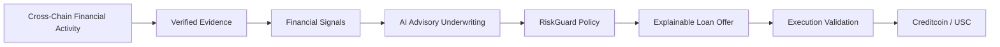

The project is designed to demonstrate that AI and blockchain can complement one another without giving an AI model uncontrolled authority over financial execution.

### Core thesis

> **Evidence establishes trust. AI provides intelligence. Policy establishes authorization. Blockchain provides execution.**

---

# 2. Why ProofLoan Exists

## The credit problem

Credit decisions depend on evidence.

In traditional finance, credit information is often stored in centralized systems.

In blockchain ecosystems, useful financial behavior may instead be distributed across:

* wallets,
* lending protocols,
* collateral positions,
* repayment transactions,
* multiple networks,
* and multiple applications.

A borrower can therefore have a meaningful financial history without having a single portable representation of that history.

## The AI problem

AI can analyze large quantities of financial information quickly.

It can:

* summarize activity,
* identify patterns,
* explain risk,
* classify behavior,
* highlight anomalies,
* and recommend actions.

But AI is probabilistic.

A probabilistic model should not automatically become an authorization mechanism for moving capital.

## The execution problem

Even when the underwriting result is correct, conditions can change.

Examples:

* evidence becomes stale,
* collateral changes,
* an offer expires,
* the wallet is on the wrong network,
* liquidity becomes insufficient,
* a blockchain node stops responding,
* or the same request is submitted twice.

ProofLoan addresses these three problems together.

---

# 3. The Core Idea

ProofLoan is based on a layered decision model.

```text
Evidence
   ↓
Verified Facts
   ↓
Financial Signals
   ↓
AI Advisory Assessment
   ↓
Deterministic Risk Policy
   ↓
Decision
   ↓
Loan Offer
   ↓
Execution Revalidation
   ↓
Blockchain Execution
```

Each layer has a different responsibility.

| Layer        | Responsibility                              |
| ------------ | ------------------------------------------- |
| Evidence     | Establish financial facts                   |
| Verification | Determine whether facts can be trusted      |
| Signals      | Convert facts into underwriting information |
| AI           | Interpret and summarize risk                |
| Policy       | Apply deterministic requirements            |
| Offer        | Translate eligibility into loan terms       |
| Execution    | Verify final transaction conditions         |
| Blockchain   | Record/execute the resulting action         |

The major design decision is that no single component has unlimited authority.

---

# 4. System Architecture

At a high level, ProofLoan consists of six logical components.

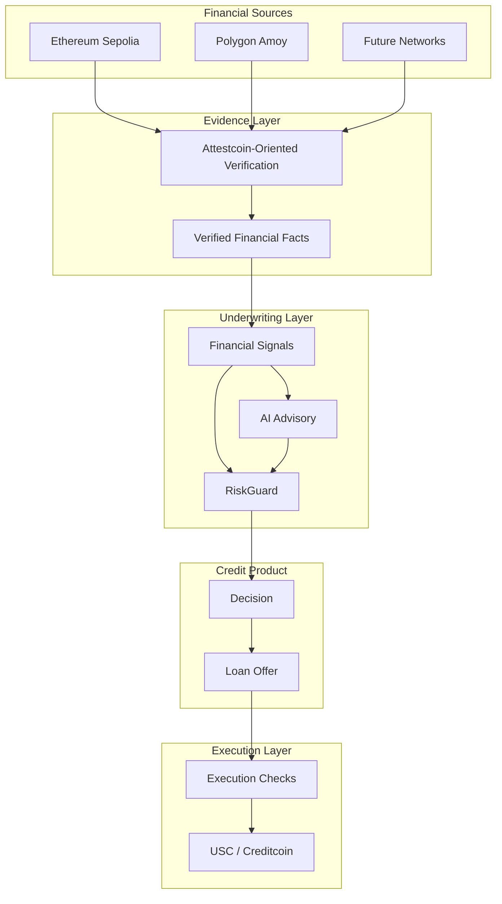

## Architectural principle

The most important relationship is:

```text
AI ──────── advises ────────┐
                            ↓
Evidence ────────→ RiskGuard ────────→ Execution
```

AI does not sit directly between the user and the blockchain transaction.

---

# 5. Cross-Chain Evidence

ProofLoan is designed for environments where financial activity is distributed across networks.

The demonstration considers evidence originating from networks such as:

* Ethereum Sepolia
* Polygon Amoy

The important concept is the ability to assemble a cross-chain financial picture.

For example:

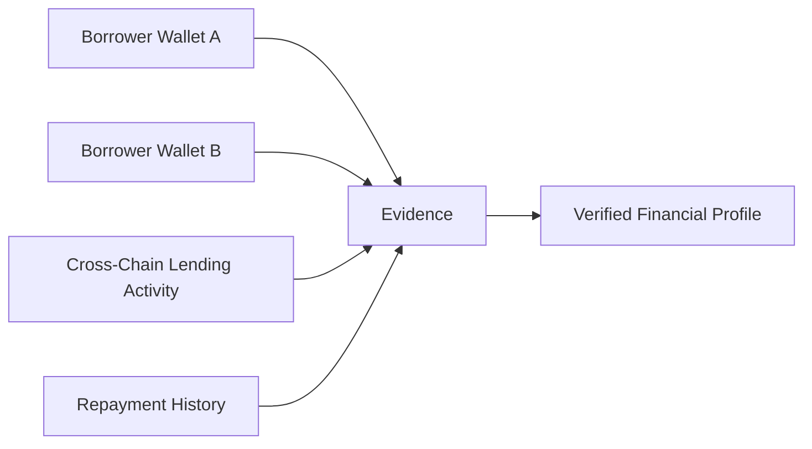

Instead of asking:

> "What happened on this one blockchain?"

ProofLoan asks:

> "What verified financial behavior can be established across the borrower's supported evidence sources?"

This opens the possibility of more portable financial reputation.

---

# 6. Attestcoin Evidence Layer

The evidence layer is the foundation of the system.

ProofLoan uses an **Attestcoin-oriented model** in which important financial events are represented as verifiable facts.

A conceptual fact can contain:

```text
Fact ID
Event Type
Subject
Source
Observed Time
Issued Time
Verification Status
Proof Reference
Transaction Reference
Expiration / Freshness
```

Example:

```json
{
  "id": "fact_001",
  "type": "REPAYMENT",
  "subject": "borrower_123",
  "source": "ethereum-sepolia",
  "verificationStatus": "verified",
  "observedAt": "2026-09-10T12:00:00Z",
  "proofRoot": "0x..."
}
```

## Why verification matters

An AI model can be excellent at interpretation but cannot solve a fundamental trust problem by itself.

If the input is false, AI may simply produce a more convincing explanation of false information.

Therefore:

```text
Bad Evidence
     ↓
Bad Feature
     ↓
Bad AI Analysis
     ↓
Bad Decision
```

ProofLoan tries to break that chain at the beginning.

```text
Unverified Evidence
        ↓
      BLOCK
```

This is the evidence-first philosophy.

---

# 7. Financial Signal Layer

Raw blockchain activity is usually too detailed for an underwriting interface.

ProofLoan converts verified facts into higher-level financial signals.

Examples include:

### Repayment Consistency

Has the borrower demonstrated repeated repayment behavior?

### Collateral Coverage

Does the borrower maintain enough collateral for the requested exposure?

### Recent Delinquency

Has the borrower experienced a recent negative payment event?

### Borrowing Behavior

Does the borrower's borrowing activity appear stable or increasingly risky?

### Evidence Freshness

Is the supporting financial information recent enough to use?

### Liquidity Context

Can the lender safely fund the proposed loan?

The transformation can be visualized as:

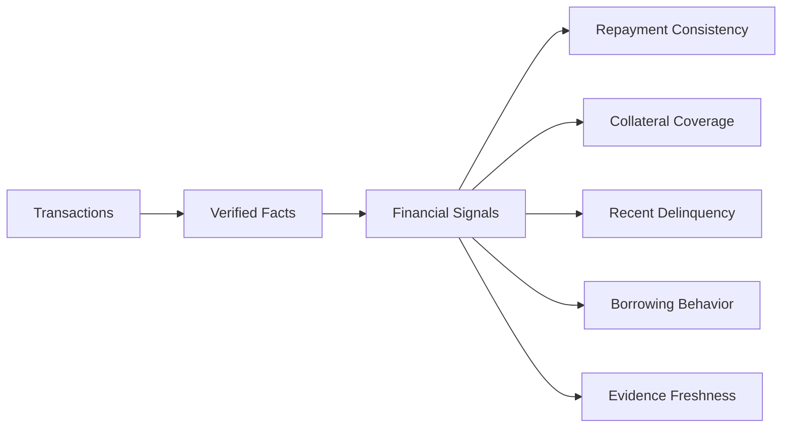

This creates a clear bridge between raw blockchain activity and human-readable underwriting.

---

# 8. AI Underwriting

The AI layer is intentionally advisory.

Its role is to help transform structured financial signals into understandable credit analysis.

A conceptual AI assessment may include:

```text
Risk Score
Risk Band
Confidence
Positive Factors
Negative Factors
Explanations
Recommendation
```

Example:

```text
Risk Band: Moderate

Positive:
+ Strong collateral coverage
+ Consistent repayment history

Negative:
- One recent late-payment event

AI Recommendation:
Review

Confidence:
Medium
```

## What AI does

AI can:

* summarize evidence,
* interpret patterns,
* compare factors,
* identify anomalies,
* explain risk,
* produce recommendations.

## What AI does not do

AI does not:

* directly authorize a loan,
* override a critical policy failure,
* bypass evidence verification,
* guarantee repayment,
* or independently execute a transaction.

This distinction is fundamental.

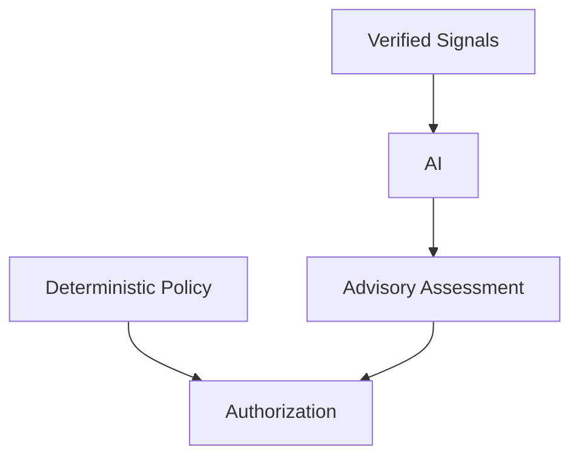

The AI recommendation becomes one input into the broader decision process rather than becoming the authorization itself.

---

# 9. RiskGuard Policy Engine

RiskGuard is ProofLoan's deterministic decision layer.

It is responsible for applying explicit lending rules.

Examples:

```text
Is required evidence verified?
Is evidence fresh?
Is collateral sufficient?
Is LTV acceptable?
Is there recent delinquency?
Is lender liquidity sufficient?
Is the application state valid?
```

A policy check can conceptually look like:

```json
{
  "id": "ltv_limit",
  "label": "Maximum LTV",
  "passed": true,
  "actual": 0.52,
  "expected": 0.60,
  "severity": "critical",
  "reason": "Loan remains within permitted collateral ratio."
}
```

## Possible outcomes

### Approved

The evidence, underwriting context, and policy requirements are satisfied.

### Manual Review

The application requires additional review.

### Blocked

A critical requirement is not satisfied.

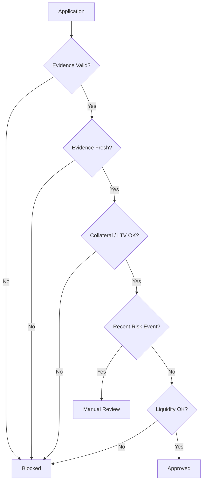

The result should be reproducible from the same inputs and policy version.

---

# 10. Credit Decision Lifecycle

A ProofLoan application moves through identifiable stages.

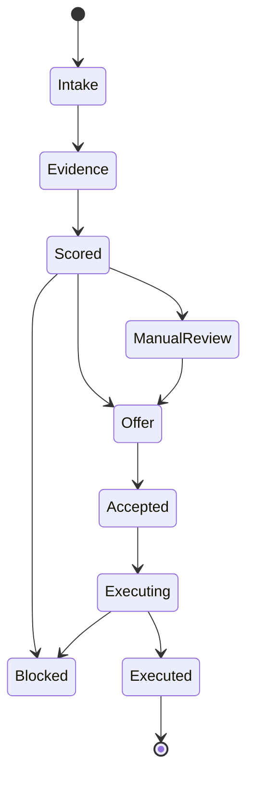

A simplified lifecycle is:

1. Application begins
2. Evidence is assembled
3. Evidence is verified
4. Financial signals are generated
5. AI provides advisory analysis
6. RiskGuard evaluates policy
7. A decision is produced
8. An offer may be created
9. The borrower accepts
10. Execution checks run again
11. The transaction proceeds or is blocked

Each stage provides a clear place to inspect what happened.

---

# 11. Loan Offer Lifecycle

A loan offer should not be treated as an isolated number.

A ProofLoan offer can be bound to the context that produced it.

Conceptually:

```text
Application
   +
Verified Evidence
   +
Financial Signals
   +
Policy Version
   +
Decision
      ↓
Loan Offer
```

Example offer information:

```text
Principal
APR
Duration
Collateral Requirement
Evidence Reference
Policy Version
Expiration
Status
```

Possible statuses include:

```text
Draft
Presented
Accepted
Expired
Executing
Executed
Cancelled
```

## Why offer binding matters

Suppose a borrower receives an offer today.

Tomorrow:

* the evidence may become stale,
* collateral may fall,
* the offer may expire,
* or lender liquidity may change.

The protocol should not blindly assume that yesterday's decision is still valid.

That is why ProofLoan revalidates important conditions before execution.

---

# 12. USC / Creditcoin Integration

Creditcoin is the target blockchain execution environment for the ProofLoan demonstration.

The project uses the **Universal Smart Contract (USC)** environment as the destination for the controlled execution stage.

The relationship is:

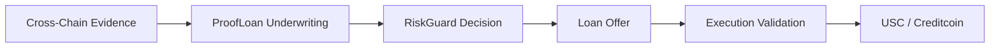

The USC layer is intentionally downstream from the underwriting process.

This means:

* evidence is evaluated first,
* AI analysis occurs before execution,
* policy controls eligibility,
* execution conditions are validated,
* and then the blockchain environment becomes the destination for the transaction.

## Why this matters

A credit application should not end at:

> "The AI says yes."

It should progress toward:

> "The evidence is valid, the policy is satisfied, the offer is active, the execution conditions are valid, and the blockchain transaction is permitted."

This creates a safer bridge between AI-assisted underwriting and programmable credit execution.

---

# 13. Controlled Execution

Execution is a separate security boundary.

Before a transaction is submitted, ProofLoan can validate:

```text
Correct borrower
Correct wallet
Correct network
Correct application
Correct offer
Offer not expired
Required collateral present
Evidence still valid
No duplicate execution
Execution conditions satisfied
```

A high-level execution gate looks like:

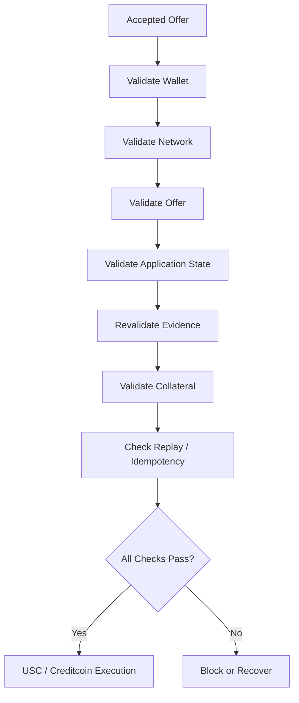

## Uncertain execution

A critical principle is:

> **Unknown does not mean successful.**

For example, an RPC timeout does not prove that a transaction failed or succeeded.

The system should move into an explicit uncertain/reconciliation state rather than assuming the result.

---

# 14. Security Model

ProofLoan uses layered security.

## Evidence Security

Unverified evidence should not become trusted underwriting input.

## AI Safety

AI should not have direct authority to move capital.

## Policy Safety

Critical constraints are expressed as deterministic rules.

## Offer Safety

Offers should be bound to valid conditions and expiration.

## Execution Safety

Transactions should be validated against the latest known state.

## Replay Safety

Repeated requests should not produce repeated financial outcomes.

## State Safety

Stale application state should not silently overwrite newer state.

---

## Security boundary diagram

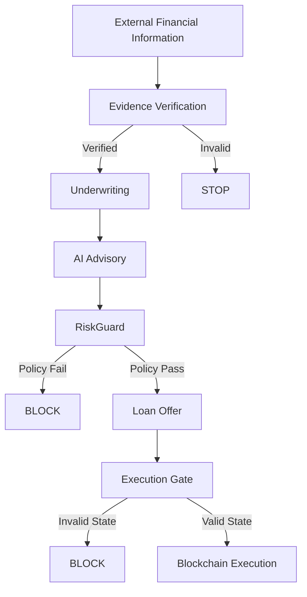

The design intentionally creates multiple opportunities to stop unsafe activity.

---

# 15. Failure and Recovery

A production-oriented credit application must assume that external systems can fail.

ProofLoan considers several failure categories.

## RPC Timeout

A blockchain node does not respond quickly enough.

**Expected behavior:** retry where safe, avoid falsely declaring success, reconcile the transaction state.

## Stale Application

A newer version of the application exists.

**Expected behavior:** reject or revalidate the stale request.

## Expired Offer

The offer is no longer active.

**Expected behavior:** prevent execution.

## Invalid Evidence

Evidence cannot be verified.

**Expected behavior:** prevent it from entering trusted underwriting.

## Duplicate Acceptance

The same offer is submitted again.

**Expected behavior:** idempotency protection prevents duplicate execution.

## Contract Revert

The blockchain rejects the transaction.

**Expected behavior:** show an explicit failure state and preserve enough information for recovery.

## Unknown Transaction State

The application cannot immediately determine the transaction outcome.

**Expected behavior:** mark the state as unknown and reconcile before another financial action.

---

# 16. Borrower Experience

The borrower experience is designed to make a complicated underwriting process understandable.

## Step 1 — Apply

The borrower begins a credit application.

## Step 2 — Establish Evidence

Relevant financial evidence is identified and verified.

## Step 3 — Understand Financial Profile

The borrower can see major financial signals derived from the evidence.

## Step 4 — Review Underwriting

AI provides an advisory interpretation.

## Step 5 — Review Decision

The borrower can understand why the application was approved, reviewed, or blocked.

## Step 6 — Review Offer

The borrower sees loan terms and conditions.

## Step 7 — Accept

The borrower accepts the offer.

## Step 8 — Execute

The system performs final checks before the transaction crosses the execution boundary.

---

## Borrower journey

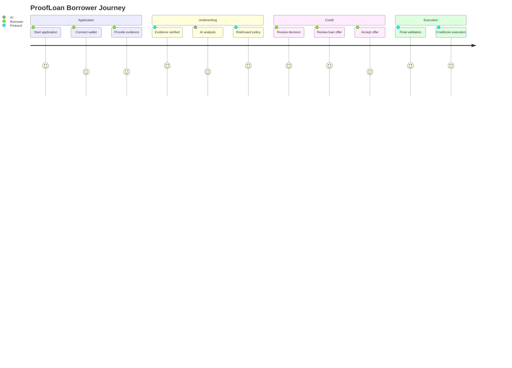

The objective is confidence through visibility.

---

# 17. Lender Experience

Lenders need a different perspective.

Instead of focusing on the borrower's journey, the lender experience emphasizes risk and portfolio context.

A lender can conceptually see:

```text
Application
Risk Band
Evidence Quality
AI Assessment
Policy Outcome
Loan Terms
Liquidity
Execution Status
```

A portfolio view can group applications by:

* Approved
* Review
* Blocked
* Executing
* Executed

It can also highlight recurring risk signals.

This allows the lender to understand not just:

> "How many loans were approved?"

but:

> "Why were they approved, and what conditions support those decisions?"

---

# 18. Judge / Demo Mode

ProofLoan is designed to be easy to evaluate in a hackathon environment.

Judge Mode provides a compressed view of the complete architecture.

A reviewer should be able to quickly see:

```text
System Status
      ↓
Applications
      ↓
Evidence
      ↓
AI Analysis
      ↓
RiskGuard
      ↓
Loan Offers
      ↓
Execution
```

## Suggested demo sequence

### Demo A — Clean Approval

Show a borrower with:

* verified evidence,
* consistent repayment,
* adequate collateral,
* acceptable LTV,
* sufficient liquidity.

Expected result:

**Approved → Offer → Execution**

### Demo B — Stale Evidence

Change the evidence state.

Expected result:

**Blocked / Review**

### Demo C — Excessive LTV

Increase requested exposure.

Expected result:

**Policy Block**

### Demo D — Wrong Network

Connect to an unsupported network.

Expected result:

**Execution Block**

### Demo E — Duplicate Acceptance

Accept the same offer twice.

Expected result:

**Second attempt rejected**

These scenarios demonstrate that ProofLoan is designed for both successful and adversarial conditions.

---

# 19. Synthetic Demo Data

The demonstration uses synthetic financial data.

This makes it possible to show realistic workflows without depending on confidential borrower information.

## Example borrower profiles

```text
Prime
Near-prime
Emerging
Thin-file
Recovery
```

## Example evidence types

```text
REPAYMENT
COLLATERAL_DEPOSIT
LATE_PAYMENT
BORROW_ORIGINATED
COLLATERAL_RELEASED
LIQUIDATION_WARNING
```

## Evidence states

```text
Fresh
Aging
Stale
```

## Example lender profiles

```text
Northstar Credit Pool
Atlas Community Liquidity
Signal Capital
Riverline Credit
```

## Demo scenarios

```text
Clean approval
Excessive LTV
Stale evidence
Tampered proof
Low liquidity
Recent late payment
Duplicate acceptance
Wrong network
RPC timeout
Contract revert
Empty evidence
```

Every synthetic scenario should be clearly labeled as demonstration data.

---

# 20. Project Structure

The repository is conceptually organized around the credit workflow.

A representative structure is:

```text
proofloan-ctc/
│
├── README.md
│
├── src/
│   ├── components/
│   ├── pages/
│   ├── hooks/
│   ├── services/
│   ├── data/
│   ├── types/
│   ├── utils/
│   └── styles/
│
├── contracts/
│   ├── interfaces/
│   ├── policy/
│   └── execution/
│
├── services/
│   ├── evidence/
│   ├── underwriting/
│   ├── policy/
│   ├── offers/
│   └── execution/
│
├── demo/
│   ├── borrowers/
│   ├── evidence/
│   ├── scenarios/
│   └── lenders/
│
├── docs/
│   ├── architecture/
│   ├── security/
│   └── whitepaper/
│
├── scripts/
│
├── tests/
│
└── package.json
```

The exact implementation may evolve, but the logical separation should remain consistent.

---

# 21. Core Data Concepts

ProofLoan relies on a few important conceptual objects.

## VerifiedFact

Represents a financial fact that can be verified.

```ts
type VerifiedFact = {
  id: string;
  type: string;
  value: unknown;
  source: string;
  subject: string;
  issuedAt: string;
  observedAt: string;
  expiresAt?: string;
  verificationStatus:
    | "verified"
    | "pending"
    | "invalid";
  proofRoot?: string;
  txHash?: string;
};
```

## AdvisoryAssessment

Represents AI analysis.

```ts
type AdvisoryAssessment = {
  score: number;
  riskBand: "low" | "moderate" | "high";
  confidence: number;
  factors: Array<{
    feature: string;
    impact: "positive" | "neutral" | "negative";
    explanation: string;
  }>;
  recommendation:
    | "approve"
    | "review"
    | "decline";
};
```

## PolicyCheck

Represents one deterministic policy result.

```ts
type PolicyCheck = {
  id: string;
  label: string;
  passed: boolean;
  severity:
    | "info"
    | "warning"
    | "critical";
  actual?: number | string;
  expected?: number | string;
  reason: string;
};
```

## Decision

Represents the final underwriting state.

```ts
type Decision = {
  id: string;
  applicationId: string;
  decision:
    | "approved"
    | "blocked"
    | "manual_review";
  evidenceRoot: string;
  featureFingerprint: string;
  policyVersion: string;
  policyChecks: PolicyCheck[];
  advisory?: AdvisoryAssessment;
  createdAt: string;
};
```

## LoanOffer

Represents the terms provided to the borrower.

```ts
type LoanOffer = {
  id: string;
  applicationId: string;
  principal: number;
  apr: number;
  durationDays: number;
  collateralRequired: number;
  policyVersion: string;
  evidenceRoot: string;
  expiresAt: string;
  status:
    | "draft"
    | "presented"
    | "accepted"
    | "expired"
    | "executing"
    | "executed"
    | "cancelled";
};
```

## TransactionRecord

Represents execution state.

```ts
type TransactionRecord = {
  operationId: string;
  applicationId: string;
  offerId: string;
  wallet: string;
  network: string;
  status:
    | "pending"
    | "submitted"
    | "confirmed"
    | "failed"
    | "unknown";
  txHash?: string;
  blockNumber?: number;
};
```

---

# 22. Typical Application Flow

The complete application lifecycle can be summarized as follows.

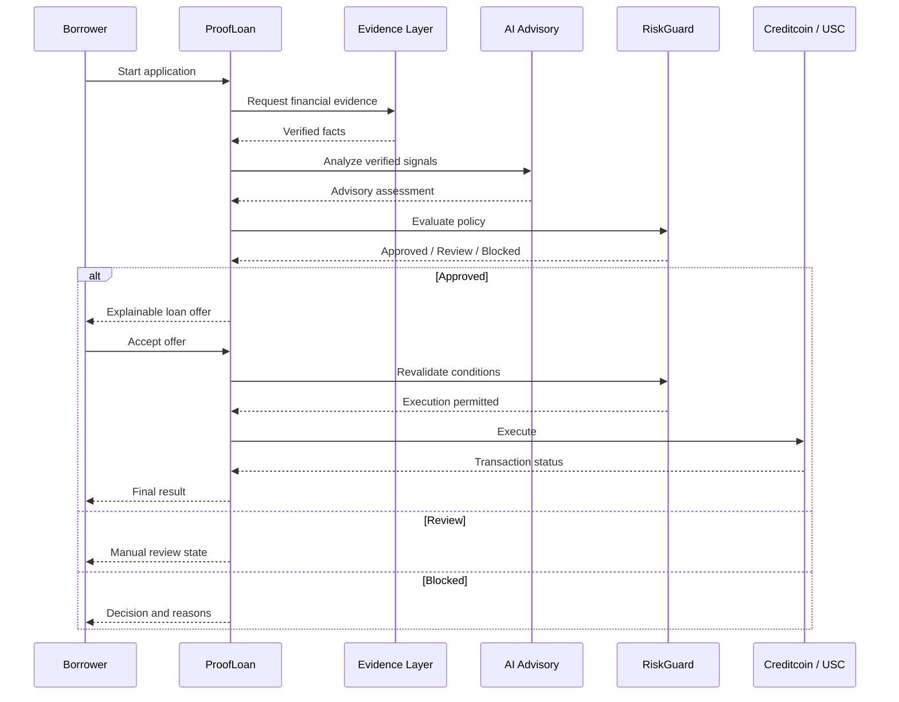

This diagram captures the key architectural principle:

**AI analysis happens before authorization, but execution requires its own final checks.**

---

# 23. Testing and Adversarial Scenarios

A meaningful credit system must test more than its happy path.

ProofLoan's demonstration should test conditions such as:

| Scenario             | Expected Result    |
| -------------------- | ------------------ |
| Clean application    | Approved           |
| Stale evidence       | Block / Review     |
| Invalid evidence     | Block              |
| High LTV             | Block              |
| Recent late payment  | Review / Block     |
| Low liquidity        | Block execution    |
| Wrong network        | Block execution    |
| Expired offer        | Block execution    |
| Duplicate acceptance | Reject duplicate   |
| RPC timeout          | Recovery / Unknown |
| Contract revert      | Failed             |
| Empty evidence       | Block              |

## Why adversarial testing matters

The most important question is not:

> "Can the system approve a loan?"

It is:

> "Can the system safely refuse an unsafe loan?"

ProofLoan therefore treats negative paths as first-class product behavior.

---

# 24. Privacy and Responsible AI

Financial systems require careful treatment of sensitive information.

ProofLoan's architecture favors use of relevant financial evidence and derived signals rather than exposing every underlying transaction to every participant.

## Responsible AI principles

### AI should be explainable

The system should provide understandable factors rather than only a score.

### AI should be bounded

AI should not have unlimited authority.

### AI should acknowledge uncertainty

Confidence is useful context, not permission.

### Evidence should remain authoritative

AI interpretation should remain downstream from evidence verification.

### Humans can remain in the loop

Certain situations can be routed to review rather than forcing every application into an automatic outcome.

---

# 25. Roadmap

## Phase 1 — Hackathon Demonstration

* Cross-chain evidence workflow
* Attestcoin-oriented evidence
* AI underwriting
* RiskGuard policy
* Explainable decisions
* Loan offers
* USC / Creditcoin execution flow
* Borrower dashboard
* Lender dashboard
* Judge Mode
* Adversarial demo scenarios

## Phase 2 — Evidence Expansion

* Additional networks
* Additional evidence types
* More verification sources
* Stronger freshness policies

## Phase 3 — Underwriting Expansion

* Improved financial signals
* Better anomaly detection
* Lender-configurable policies
* Portfolio-level risk analytics
* More sophisticated explanations

## Phase 4 — Production Readiness

* Broader execution integrations
* Security audits
* Governance
* Monitoring
* Institutional integrations
* Regulatory and compliance readiness

---

# 26. Limitations and Risk

ProofLoan is a prototype architecture and demonstration.

Several challenges remain before production use.

## Data Quality

The value of underwriting depends on the quality and authenticity of the underlying evidence.

## AI Reliability

AI output can be incorrect or uncertain.

## Blockchain Risk

Smart contracts and blockchain infrastructure can contain technical vulnerabilities.

## Market Volatility

Collateral values and liquidity can change rapidly.

## Cross-Chain Complexity

Multi-network systems introduce additional operational and data consistency challenges.

## Regulatory Considerations

Credit products may be subject to financial, lending, privacy, consumer protection, and jurisdiction-specific requirements.

ProofLoan does not claim to eliminate these risks.

The objective is to make them visible and build architectural mechanisms around them.

---

# 27. Why This Architecture Matters

ProofLoan is not simply another AI credit-score interface.

Its key contribution is the separation of responsibilities.

Traditional simplified flow:

```text
Data → AI → Decision
```

ProofLoan:

```text
Data
 ↓
Verified Evidence
 ↓
Financial Signals
 ↓
AI Advisory
 ↓
Deterministic Policy
 ↓
Explainable Decision
 ↓
Execution Validation
 ↓
Blockchain
```

That distinction is important because financial systems need both intelligence and control.

AI is excellent at helping people understand complex information.

Blockchain is excellent at creating transparent and programmable execution environments.

Deterministic policy provides the bridge between the two.

---

# 28. Quick Start

The exact commands depend on the current repository configuration, but a typical JavaScript/TypeScript application can be started with:

```bash
git clone https://github.com/lucylow/proofloan-ctc.git
cd proofloan-ctc

npm install

npm run dev
```

For a production build:

```bash
npm run build
npm run preview
```

If the project includes separate contract or service packages, install and run those according to their individual package configuration.

## Environment configuration

Use an environment file where appropriate.

Example categories may include:

```text
Blockchain RPC
Wallet / signer configuration
AI service configuration
Evidence provider configuration
Creditcoin / USC configuration
Demo mode
```

Never commit:

* private keys,
* seed phrases,
* production API keys,
* database credentials,
* or other secrets.

---

# 29. Demo Walkthrough

A strong ProofLoan demonstration can be completed in several minutes.

## Step 1 — Open the dashboard

Show the overall protocol state.

Highlight:

* active applications,
* evidence state,
* underwriting activity,
* offers,
* execution state.

## Step 2 — Open a clean borrower

Show:

* verified evidence,
* repayment behavior,
* collateral,
* AI assessment,
* RiskGuard results.

Expected outcome:

**Approved**

## Step 3 — Open the explanation

Show how the decision was produced.

Example:

```text
Evidence:
Verified

AI:
Moderate risk
High confidence

Policy:
LTV passed
Collateral passed
Freshness passed
Liquidity passed

Decision:
Approved
```

## Step 4 — Open the offer

Show:

* amount,
* APR,
* duration,
* collateral,
* expiration.

## Step 5 — Accept the offer

Trigger the controlled execution process.

## Step 6 — Demonstrate an adversarial case

Choose stale evidence, high LTV, wrong network, or duplicate acceptance.

Show the system refusing the unsafe path.

## Step 7 — Show execution

Demonstrate the final Creditcoin/USC execution boundary.

The strongest demo is not just:

**"Look, the loan worked."**

It is:

**"Look, the system understands why it worked—and why it refuses to proceed when the conditions become unsafe."**

---

# 30. Conclusion

ProofLoan A.I. is a proposal for a new type of blockchain credit infrastructure.

It combines four important capabilities:

### Verifiable Evidence

Financial behavior can be represented as evidence with provenance and verification context.

### Intelligent Underwriting

AI helps turn complex financial activity into understandable risk analysis.

### Deterministic Authorization

RiskGuard makes critical lending requirements explicit and reproducible.

### Controlled Blockchain Execution

USC/Creditcoin provides the target environment for turning an approved credit decision into a controlled blockchain transaction.

The result is a credit architecture designed around accountability.

```text
Verified Evidence
       ↓
Intelligent Underwriting
       ↓
Transparent Policy
       ↓
Controlled Execution
```

ProofLoan's fundamental belief is simple:

> **Credit should not depend on a black-box score.**

Borrowers should be able to demonstrate financial behavior.

Lenders should be able to understand the reasoning behind a decision.

AI should accelerate underwriting without becoming an unchecked financial authority.

Blockchain should provide a verifiable and programmable execution environment.

That is the role ProofLoan A.I. aims to play.

---

# Architecture at a Glance

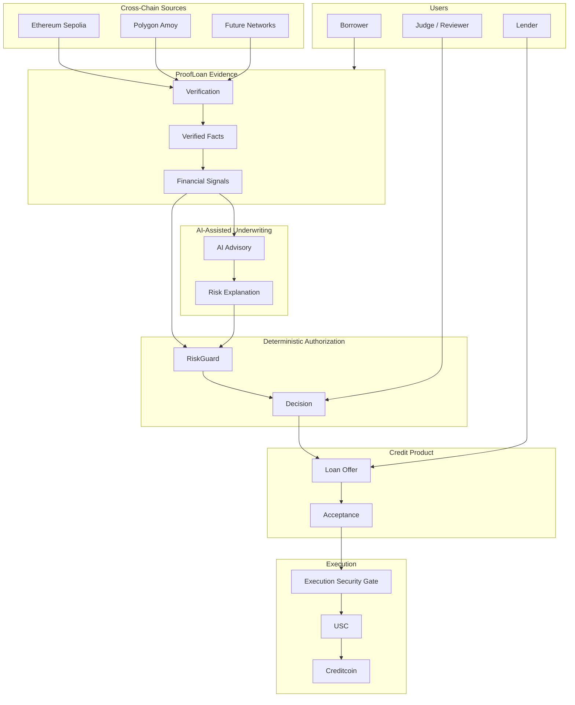

---

# Security Philosophy

```text
If evidence is uncertain:
    do not trust it.

If AI is uncertain:
    do not treat confidence as authorization.

If policy fails:
    do not execute.

If transaction state is unknown:
    do not assume success.

If offer is expired:
    do not execute.

If the request is duplicated:
    do not execute twice.
```

> **Uncertainty should never become authorization.**

---

# Product Philosophy

ProofLoan A.I. is intentionally built around a simple distinction:

| Question               | Responsible Layer      |
| ---------------------- | ---------------------- |
| What happened?         | Verified Evidence      |
| What does it mean?     | AI / Financial Signals |
| Is it allowed?         | RiskGuard              |
| What are the terms?    | Loan Offer             |
| Can it execute now?    | Execution Gate         |
| Where does it execute? | USC / Creditcoin       |

This separation is the foundation of the ProofLoan architecture.

---

# Links

**GitHub Repository**
https://github.com/lucylow/proofloan-ctc/tree/main

**Project Design / Presentation**
https://canva.link/dor3hfsg44zlhej

**Project Whitepaper**
https://docs.google.com/document/d/1heJo1Bt5VC07fGQ4jd_t2f2MR8wRzQsVBjmx91Chjxw/edit?usp=sharing

---

# Hackathon Positioning

**Project:** ProofLoan A.I.

**Tagline:** Verifiable Cross-Chain Credit Underwriting for the Real World

**Primary Theme:** AI + Blockchain + Credit

**Execution Target:** Creditcoin / USC

**Evidence Layer:** Attestcoin-oriented verified facts

**Core Differentiator:**

> **AI advises. Evidence verifies. Policy decides. Blockchain executes.**

---

# Final One-Line Summary

**ProofLoan A.I. turns verified cross-chain financial evidence into explainable, AI-assisted credit decisions with deterministic risk controls and controlled Creditcoin/USC execution.**
